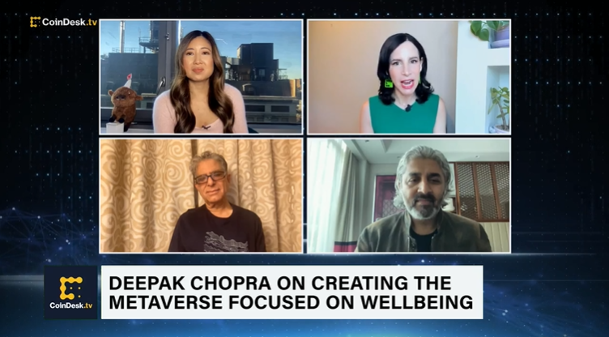

# Deepak Chopra 表示，如果科技巨兽出于错误原因进入元宇宙，它们可能会变成“恐龙”

畅销书作家迪帕克·乔普拉（Deepak Chopra）说，如果科技巨头想要产生真正的影响并避免“恐龙”的命运，他们进军虚拟世界需要更好的动力，而不仅仅是赚钱。

Chopra 周四告诉 CoinDesk TV 的“[先行者](https://www.coindesk.com/video/deepak-chopra-on-metas-metaverse-the-giants-may-not-survive/)”，就像恐龙一样，当涉及到大科技时，进化的原则往往会“解决所有问题”。

“整个元宇宙正在演变……它势不可挡，”乔普拉说。“正如我们过去所看到的，当技术实现创造力的飞跃时，巨头们可能无法生存。”

Chopra 说，与元宇宙一样，加密技术将继续存在，但它的发展将取决于耐心和基于 Web3 的项目背后更深思熟虑的动机。

“如果动机只是金钱，那么它[不会] 有未来，”乔普拉说，指的是试图成为元宇宙先驱的科技集团，如 Meta。Meta 最近报告称，其进入 Metaverse 的投资并未达到预期的收益，上一季度亏损超过 37 亿美元。

[基于 Web3 的平台Seva.Love](http://seva.love/)的联合创始人 Chopra也在冒险进入元界。他的“ [ChopraVerse](https://www.prnewswire.com/es/comunicados-de-prensa/deepak-chopra--sevalove-announce-chopraverse-house-of-enlightenment-the-metaverse-for-wellbeing-in-collaboration-with-utopia-301633196.html) ”将尝试通过使用教育工具以及支持心理健康和福祉的平台来创建一个更具社会意识的 Web3 社区。

“我们进入元宇宙的冒险只是为了幸福，”乔普拉说。

他说，世界上的心理健康状况正处于“危机”之中，并受到技术“黑暗面”的影响。但是因为技术是中立的，所以它可以被善用——只要 Web3 项目背后的意图是真实的和有目的的。

谈到意图，乔普拉说，他对那些吹捧加密货币或其他基于数字的代币或他们知之甚少的项目的名人持批评态度。这些名人在宣传“不是他们的专长”的东西时应该“非常小心”。

然而，“Chopraverse”中有名人：Alejandro Saez、Maria Bravo、Eva Longoria 和 Javier Garcia。

在 Twitter 上拥有超过 300 万粉丝的乔普拉表示，他领导“Chopraverse”并不是因为他是名人，而是因为他一直处于“思想、身体和医学的前沿”。

“这是创造力的下一个飞跃，”乔普拉说。
