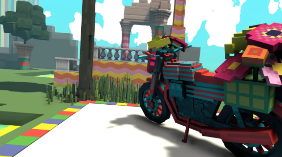

# Gucci Vault 在 The Sandbox 中以游戏和复古时尚开启元宇宙世界

Gucci 的虚拟世界现已在数字房地产平台 The Sandbox 上开放，扩展了其 Gucci Vault 虚拟世界中心，并使其成为第一个在该平台上拥有自己空间的主要时尚品牌。

这个名为 Gucci Vault Land 的虚拟世界从今天到 11 月 9 日开放。旨在成为 Gucci 的所有“多元宇宙”和 Web3 工作的登陆空间，世界将成为精选 NFT 艺术品、Gucci 以前的 NFT、它的社区、它的花园概念的家园（用户通过“好奇花园”进入空间）以及该品牌的复古作品，这些作品将展出，但不出售。该空间还将有关 Gucci 传统和产品的教育游戏化。

Gucci于 2 月首次宣布已在 The Sandbox 上购买数字地产，并计划在该平台上开设自己的“互动时尚体验”。沙盒通常会在称为季节的固定时间范围内打开这些类型的体验；第 3 季于 8 月开始。Gucci 尤其在本季框架之外推出了世界，突显了 Gucci 的存在为该平台带来的独立拉力。

这是 The Sandbox 的第一个主要时尚品牌展示，Gucci 合作伙伴阿迪达斯也已购买并正在开发房地产。（6 月，NYX Cosmetics 为 Pride 开启了淡季体验。）Gucci 一直是第一个使用许多 Metaverse 和 Web3 技术的奢侈品牌：它是第一个制作 NFT 的奢侈品牌（2021 年 5 月）及其Gucci Garden同月在 Roblox上是同类产品中的第一个，因此获得了 Webby 奖。它在 Discord 上推出了自己的社区，并计划将其延续到 The Sandbox 世界。

照片：古驰

- 

与其正在进行的名为 Gucci Town 的 Roblox 空间类似，Gucci Vault Land 以“play-to-know”叙事为中心——对日益流行的“play-to-earn”格式的即兴表演，其中用户完成活动以获得区块链- 基于代币或奖励。参观者将被邀请完成有关其“核心支柱”的游戏化任务，例如在 Vault Vintage Lab 中修复复古手袋，并在 Vault Room of Rhyme 中解谜。所有这些迷你游戏都将使玩家更有机会赢得 The Sandbox 组织的 Sand 实用代币抽奖，该代币是 The Sandbox 基于以太坊的货币，在整个平台上使用。

通过这些游戏化的步骤，该品牌旨在让 Web3 社区了解 Gucci 的传统，让用户了解 Vault 支柱的不同元素，例如复古、新兴设计师和 Web3 激活。它还希望吸引非本地用户，并认识到对于那些较新的元宇宙体验的潜在需求。NPC（意为“不可玩角色”）将在 Gucci Vault Land 各处游荡，随时准备在整个活动中帮助玩家。

除了小游戏，还有数字收藏 NFT 供玩家赢取，然后他们可以在其他沙盒土地上佩戴；想想帽子、滑板坡道和汽车。Gucci 的元宇宙忠实拥护者还有额外的福利：Gucci Vault NFT 持有者（包括 Supergucci 和 Gucci Grail NFT）将被空投 Gucci Vault Aura 收藏品，他们的化身可以在整个沙盒中佩戴，在新的元宇宙空间中展示他们对 Gucci 的忠诚度.

该公告是在 Gucci任命 Robert Triefus为 Gucci Vault 和 Metaverse Ventures 的首席执行官之后发布的，Micael Barilaro 也加入了他担任 Metaverse Ventures 副总裁的新角色。在 Triefus 之前担任品牌和消费者参与执行副总裁的领导下，Gucci尝试了Zepeto、Genies 和*The Sims等全球游戏世界。此后，该品牌在 2022 年与 Roblox 上的 Gucci Town 以及与NFT 项目 10KTF的合作，加深了其元宇宙的存在。

后两个项目在 2021 年 9 月概念店首次亮相后，在 Gucci Vault 的保护伞下。下一步行动更明确地与 Vault 联系在一起，培育一个元宇宙空间，将项目的 NFT Drops 和策展组合在一起，复古 Gucci 作品以及新兴的标签和创作者。

时尚品牌已迅速开始在元界和 NFT 中进行试验，但随着 Forrester 预测，随着炒作的降温，这些激活将受到考验。目前，Gucci 对虚拟世界中的第一的持续承诺表明了该品牌在数字空间中看到的长期价值。

2022 年 3 月，首席执行官 Marco Bizzarri告诉Vogue Business，“Gucci 不惧怕在许多领域成为先行者，并将继续采用这种心态并挑战现状。” Gucci 的策略不是——现在仍然不是——为了安全起见。“其他大公司宁愿等待，在稍后阶段跟进，采取更对话的方式——这是一种值得尊敬的策略，但它不是我们的，也永远不会是。”
