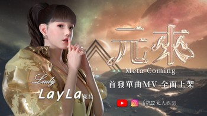
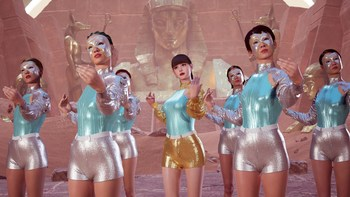

# 认识Metastar首个元宇宙偶像——Layla，出道单曲《Meta-Coming》开创华语流行未来

想象一个栩栩如生的虚拟世界，人们在“真实”物理世界中舒适地坐在沙发上与他人生活、工作、联系和协作。

今天，元宇宙正在互联网上构建，以无缝结合我们的物理和数字生活。在元宇宙中，人们可以穿越一个模拟物理世界许多方面的虚拟世界，所有这些都使用包括虚拟现实 (VR)、增强现实 (AR)、混合现实 (MR)、人工智能 (AI)、社交媒体在内的技术、数字货币等等。

这种身临其境的虚拟环境无疑是令人兴奋的，Meta、谷歌和微软等大公司都在努力让虚拟世界栩栩如生。这个平台的潜力是无限的：一个游戏区、一个零售点、一个培训工具、一个购物天堂、一个数字3D教室。. . 现在是令人兴奋的音乐体验！

现在，经过 3 年的紧张工作，Metastar 刚刚推出了 Layla 女士，她是第一位存在于 Metaverse 中的虚拟台湾流行歌手。

Lady Layla融合了时尚和流行，拥有时尚的外观和首张单曲“Meta-Coming”，旨在为年轻一代的歌迷提供与音乐和艺术家联系的新方式。这首新歌以快节奏的节奏移动，具有强烈的现代电子和嘻哈氛围，展示了艺术家在节奏之间切换和跨音域移动的能力。引人注目的表演还包括与一群舞者同步的动态、高度编排的动作。

像所有人一样，Layla 女士通过与世界互动来学习、成长和进步。这位年轻的偶像被设定为一个具有相生特征和魅力的聪明的 20 岁女性，以好奇和热情追求自己的梦想。然而，Metastar 强调“没有人是完美的”，Layla 女士和我们所有人一样，在许多方面仍有改进的空间。例如，与流行音乐界的任何新人一样，Layla 女士和她的歌声、表情、动作等仍然可以改进。 

毫无疑问，数字世界正在迅速变化。例如，互联网是我们可以浏览的东西，但现在，在某种程度上，我们可以“生活”在虚拟世界中。很快，粉丝们将能够参与Layla女士的活动，享受她的直播，与她互动等等！虽然元宇宙继续发展，但释放下一波数字颠覆的潜力显然就在这里。

**从 10/27 开始，Layla 女士的首张单曲将在大多数音乐频道播放。**

**关于 Metastar**

Metastar 是一家多才多艺的公司，在内容创作、视频导演/制作、3D 动画、软件和硬件解决方案、人工智能、增强现实、虚拟现实应用等领域拥有一流的专家。

作为第一家也是唯一一家元界偶像经纪公司，Metastar 通过创造、开发和管理新的偶像和机会，包括建立业务关系、负责各种项目的营销、推广和执行，继续为元界提供现代数字技术，以及更多。

Lady Layla是Metastar的第一个签约偶像，近期还会推出更多精彩的明星。
