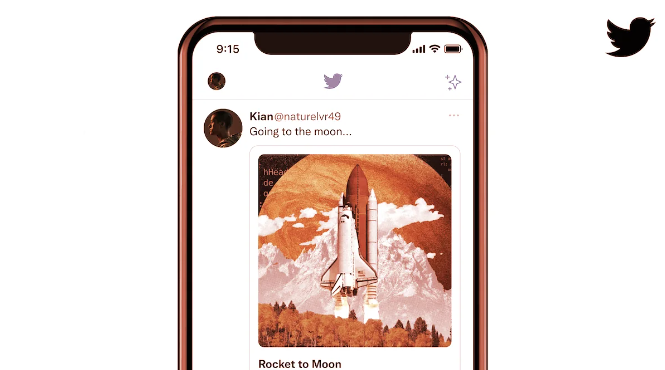

# Twitter 将允许用户通过推文买卖 NFT

Twitter 的 NFT Tweet Tiles 集成。图片：推特

社交媒体平台 Twitter今天（10月28日）宣布，它将与四个市场合作，让用户通过推文直接购买、出售和展示 NFT。

该集成称为 NFT Tweet Tiles，在推文的专用面板中显示 NFT 的艺术作品，并包括一个按钮，让用户点击进入市场列表。

该集成目前仍在测试中，目前与来自四个特定合作伙伴的市场合作：以 Solana 为中心的市场 Magic Eden、多平台 NFT 市场协议 Rarible、Flow 区块链创建者 Dapper Labs 和以体育为中心的平台 Jump.trade。

总的来说，这些市场跨越了多个区块链网络，包括[Ethereum](https://decrypt.co/?post_type=post&p=5726)、[Solana](https://decrypt.co/resources/what-is-solana-a-scalable-decentralized-network-for-dapps)、[Flow](https://decrypt.co/resources/what-is-flow-dapper-labs)、[Polygon](https://decrypt.co/resources/what-is-polygon-matic-and-why-it-matters-for-ethereum)、[Tezos](https://decrypt.co/price/tezos)和 Immutable X。

Twitter 代表向 *Decrypt*证实，该功能与区块链无关，因此只要链接来自合作市场，所有网络都受支持。

该代表补充说，“目前正在通过 iOS 和 Web 上的选定 Twitter 用户测试该功能”，如果这些用户在测试组中，他们将看到 NFT Tweet Tile 集成。使用该功能不需要 Twitter Blue 高级订阅。

Twitter 此前在 1 月份通过其 Twitter Blue 订阅服务[支持将 NFT 作为经过验证的个人资料图片](https://decrypt.co/90847/twitter-nft-profile-picture-verification)，但目前仅支持以太坊 NFT。
