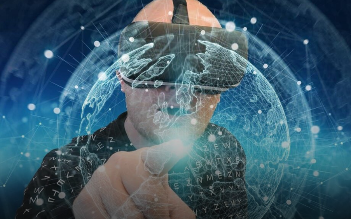

# 第一个在墨西哥兴起的 Metaverse 购物中心

墨西哥在虚拟世界和 web 3 边界内的加密友好制度测试、交互和构建创新发展方面仍然首屈一指。事实上，由于通货膨胀问题的加剧，这个北美国家已经变成了一个以加密货币为中心的政府，并采用了数字资产。 

墨西哥在这方面引入了它在元界空间中的第一个购物中心类型。该平台名为Island Shopping Mall，于昨天启用，目前拥有约80个品牌。它包括 Pai Pai、Momiji、Victoria's Secret 等知名品牌，以及其他期待在全球扩大影响力的公司。 

值得注意的是，元界平台计划总共列出 800 多个品牌，并将随着时间的推移继续整理其他品牌的存在。

这就是 Metaverse 购物平台的不同之处，因为它能够对开发人员可以想象的尽可能多的品牌进行编程。此外，虚拟购物包括根据新兴品牌的特定区域对不同产品的质量进行分类。入职品牌将在公共或私人区域推出。 

据公告，新型购物商城现已上线，用户可通过下载商城应用进行互动，享受“海岛天堂，在线畅玩”。此外，通过购物中心进行的在线购买将为用户赚取细菌，这些细菌可用于获得优惠券代码和岛屿空间内购物点的折扣。 

## 重量级加入墨西哥首个元界购物中心

参与墨西哥购物中心的其他大牌包括 Biso、LA Colors、Bath & Body Works 和 GOC。该消息还提到，支持该购物中心的企业家还与其他品牌合作，如 Puma、Nike、Adidas、Levi's、Bershka、Guess 和苹果等科技巨头。 

值得注意的是，其中一些品牌已经在构建自己的 Metaverse 战略，例如 Apple 目前正在开发硬件以体验最佳的 Metaverse。同样，Guess推出了 Metaverse 商店，Nike 也扩展了其业务战略，依靠 Metaverse 和 NFT。

Metaverse 购物中心的推出揭示了墨西哥人越来越多地采用 web 3 技术和加密货币领域。Hellosafe 网站发布的比较报告显示，墨西哥拥有拉丁美洲最大的元界市场。在这次衰退期间，墨西哥经济也受到通货膨胀的不利影响。因此，该州居民最终转向加密货币以扩大赚钱机会。 

根据统计数据，超过 13,000 名墨西哥投资者已将资金投入元界和加密公司。该报告预计，截至今年年底，墨西哥的市值将达到 6500 亿美元。根据报告，如果实现，这一增长将进一步引发 435.5 亿美元的巨大增长。 
