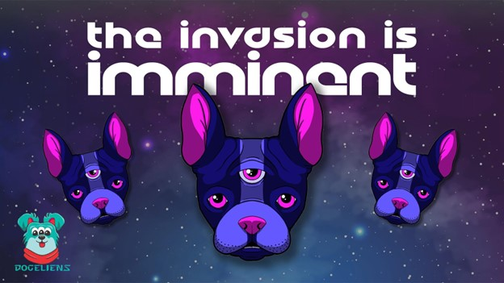
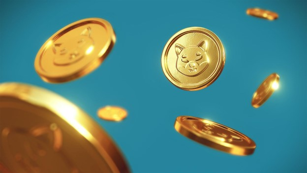
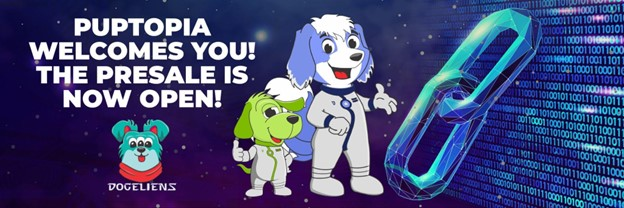

# DOGELIENS——一个与 METAVERSE 集成的 MEME 项目计划主导 SHIBA INU 和 PANCAKESWAP 项目

[Dogeliens](https://dogeliens.io/)与 Dogecoin 和 Shiba Inu 等其他以狗为主题的资产有许多相似之处。然而，这将不是隐藏在狗狗币保护伞下的另一个模因项目。

Dogeliens 以其众多的功能领先于同类产品。它为用户提供了对其 metaverse 的访问权限，这是一种旨在满足所有用户需求的增强现实。这个虚拟世界包含充满乐趣的游戏和赚钱机会。

在本文中，我们将讨论 Dogeliens 的功能以及它打算如何保持独特性。我们还将比较 Dogeliens、Shiba Inu 和 Pancakeswap，强调为什么 Dogeliens 有更好的机会。

**Dogeliens – 以狗狗为主题的代币独特功能**

Dogeliens 是一个模因硬币项目，旨在取悦其加密社区。它的用户可以利用大量机会来改善他们的生活。Dogeliens 将推出的教育平台将有助于加快加密货币的增长和接受度。

巴金顿大学 Dogeliens 教育平台对其加密社区的所有成员开放。在这里，它将传播有关区块链技术的最新信息。

注册学生将拓宽他们在加密货币、DeFi 和 NFT 领域的知识。课程将通过精心准备的视频、文本和作业进行。在本课程结束时，学生将有能力在这个领域茁壮成长并保持盈利。

除了学习加密货币外，Dogeliens 学院还将帮助学生接受初等教育。其中包括写作、阅读、地理和数学等领域的课程。

**Dogeliens 慈善机构**

Dogeliens 的另一个方面是它希望支持慈善组织。Dogeliens 预留了一个慈善钱包，里面装满了每月完成的所有交易的 3%。

它还赋予其用户在每个月底确定哪个慈善组织获得资金的特权。捐款将以 Dogeliens 的本地加密货币 DOGET 进行。

这些慈善组织的目标与 Dogeliens 类似。正如 Dogeliens 旨在教育每个人一样，这些组织将使用捐赠的资金来实现类似的目标。

**Dogeliens 元宇宙**

Dogeliens metaverse 将是一个复杂的虚拟世界，旨在满足其所有用户的需求。它将吸引许多人加入 Dogeliens，并通过其 GameFi 机会和教育选择建立一个活跃的社区。

Dogeliens 元界将为用户提供互动和参与的空间，与一群志同道合的人共同体验元界，这些人也对 meme 令牌空间有既得利益。

该空间被称为“The Spacehip”，将是一个互动空间，Dogeliens 代币持有者可以聚集在一起，代币的所有权还提供各种其他机会，例如通过对项目未来的投票提供指导。

这是一个广阔而广阔的空间，肯定会为用户提供多种刺激。

**Dogeliens 与 Shiba Inu 和 Pancakeswap 相比**

Shiba Inu 与 Dogeliens 有相似之处，因为它们都是模因项目。他们共享一个共同的基础模因，即狗狗币利用的病毒性狗狗模因。Shiba Inu 在成立之初就发展迅速，并在短时间内成为第二大 meme 项目。

Pancakeswap 是币安网络上使用最多的去中心化交易所之一。它托管大量 BEP-20 代币，促进了交换。Pancakeswap 还为 Staking 和收益农业打开了大门。

Dogeliens、Pancakeswap 和 Shiba Inu 都作为权益证明平台运行。因此，Dogeliens 有一个因素可以帮助它在这一领域取得成功。它作为模因硬币的力量将帮助它迅速普及。同时，其下一代功能将帮助它获得加密爱好者的认可。

**Dogeliens 预售**

Dogeliens 目前正在预售中。Dogeliens Universe 已准备好将总代币供应量的 30% 分配给预售和奖励款待。因此，现在是社区参与并享受奖励的时候了。

想要购买 DOGET 的用户应该通过 Metamask 或 Trustwallet 创建一个钱包。然后用任何加密货币为你的钱包注资。访问 Dogeliens 的官方网站并访问预售页面。连接您的钱包并批准交易。

在预售阶段 1 中使用 ETH 购买 DOGET 的用户将获得总计 20% 的交易奖励。此外，当新用户通过您的推荐链接购买价值 250 美元的预售商品时，您将获得 50 美元的奖金。

**结论**

Dogeliens 生态系统是一个用户友好的平台，为用户和慈善组织提供了足够的奖励机会。该生态系统将使用其原生加密货币对加密用户产生积极影响。立即购买此代币以享受其好处。
