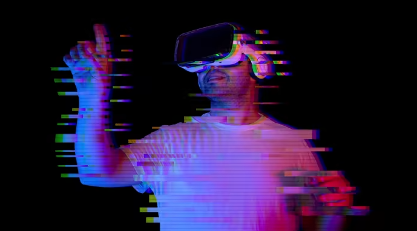

# 大型科技公司蹑手蹑脚地进入元宇宙

元宇宙？什么元宇宙？本周在 Apple 年度开发者大会上收听主题演讲并期待一睹更身临其境的 3D 数字世界的任何人都会感到非常失望。

与普遍的预期相反，没有提到苹果备受期待的[增强现实](https://www.ft.com/stream/d7403c70-5de7-4303-93b2-ba04494fc525)耳机，也没有提到 ARKit，这个软件平台可以让开发人员创建在设备上运行的应用程序。

在过去一个月的[谷歌](https://www.ft.com/stream/d6b12f0c-bf3f-4045-a07b-1e4e49103fd6)和微软开发者活动中，虚拟世界同样出人意料地缺乏知名度。无论这些公司为什么可能成为自智能手机以来最重要的计算进步而制定的计划，他们都没有准备好大喊大叫。

年度开发者大会是领先科技公司激励全球软件开发者创建能够吸引数十亿人使用其平台的应用程序的重要时刻。在所有的期待之后，他们对元宇宙的集体谨慎是值得注意的。

这种沉默给人们留下了不可避免的印象，即这些公司仍然认为将这项技术推向大众市场还为时过早——或者，至少，他们还没有弄清楚它如何融入自己的业务。只有在 Facebook 社交网络之外寻找新未来的 Meta 公司一直在努力推动这一想法。

最近的谨慎表明，该行业仍在努力解决因元宇宙的到来而悬而未决的两个问题。一个问题是很难设计出一种大量人想要在很长一段时间内佩戴的耳机。

自谷歌推出其 Glass 以来已有十年，这是对轻量级增强现实设备的一次尝试。距 Facebook 收购 VR 公司 Oculus 已有八年，距微软展示其滑雪护目镜式 AR 耳机 HoloLens 已有七年。

然而，未来在哪里仍然不清楚：在笨重的、完全沉浸式的 VR 中，脱掉眼镜，还是介于两者之间？就像 iPhone 出现之前的智能手机世界一样，科技行业仍在等待能够为视觉优先计算的未来指明道路的设备。

大多数大型科技公司谨慎的第二个原因是，元界仍然没有明确的定义。很容易理解完整的 VR 世界。很难预期将虚拟与现实融合的沉浸式方法更少。它是否涉及在物理世界上粘贴数字信息，例如战斗机飞行员的显示器？在巨大的 IMAX 屏幕前享受娱乐？或者与其他看似真实的化身互动？

正如谷歌在 2012 年发布 Glass 时发现的那样，过早地将开发人员推向不成熟的愿景可能会适得其反。公开邀请开发人员开始创作导致了大量的浪费努力，并且没有更接近揭示增强现实的未来。

Meta 正在促进完全沉浸在 VR 中。但普通用户可能不会觉得这很有吸引力：在 VR 中为没有腿的化身的人举办商务会议——三年前就证明了这一点——可能会显得既平庸又令人毛骨悚然。

当涉及到特定的企业应用程序时，可能会有更清晰的用途。例如，微软一直在大力推动公司创建办公楼或制造流程的“数字双胞胎”的想法，以便他们可以制作模型来了解变化可能如何影响他们的业务。

但是对于大多数人来说，哪些应用程序看起来足够重要以至于值得戴上特殊的耳机并不那么明显。结果是大型科技公司采取了令人惊讶的谨慎态度。

谷歌在今年的活动中唯一提到了增强现实技术，它展示了一个简单的翻译应用程序，让戴着智能眼镜的人可以在观看别人用不同语言交谈的同时看到字幕。与十年前华丽的 Glass 推出形成鲜明对比。

目前，有所保留是有道理的。据报道，苹果正在开展少量的演示项目，以充分展示其 AR 护目镜。它仍然有可能在今年晚些时候推出备受期待的耳机。

大多数大型科技公司都在向元宇宙倾斜。但请不要误会：当发令枪终于响起时，争夺下一个大众市场计算平台的竞争将十分激烈。
