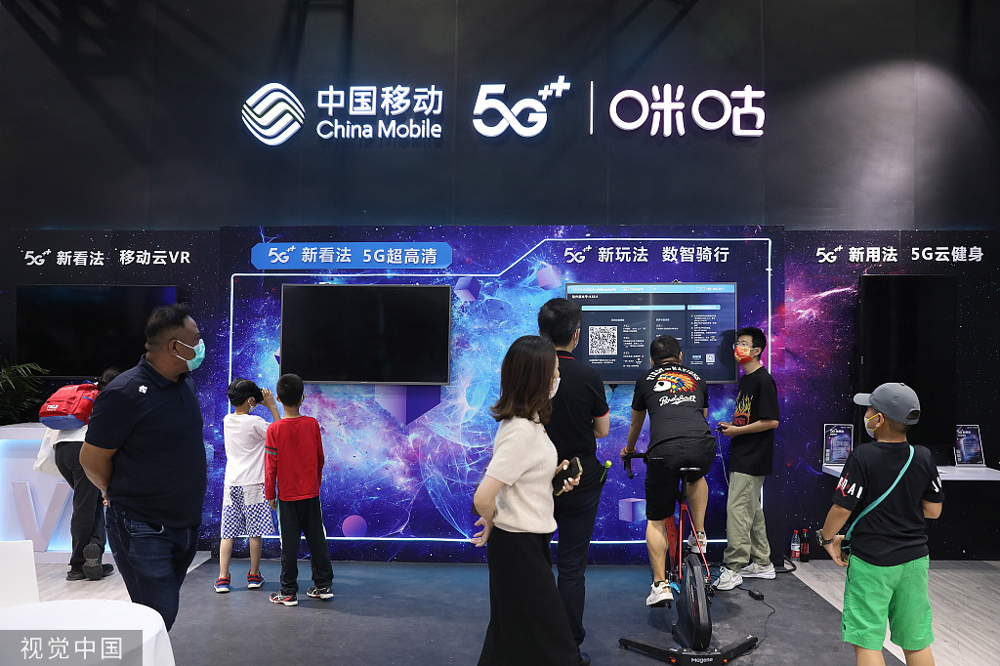
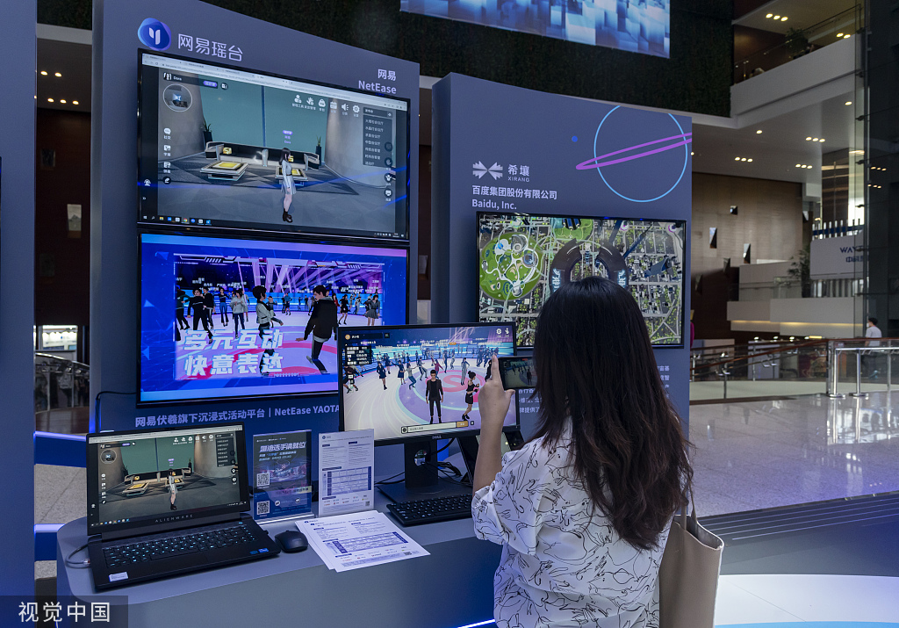
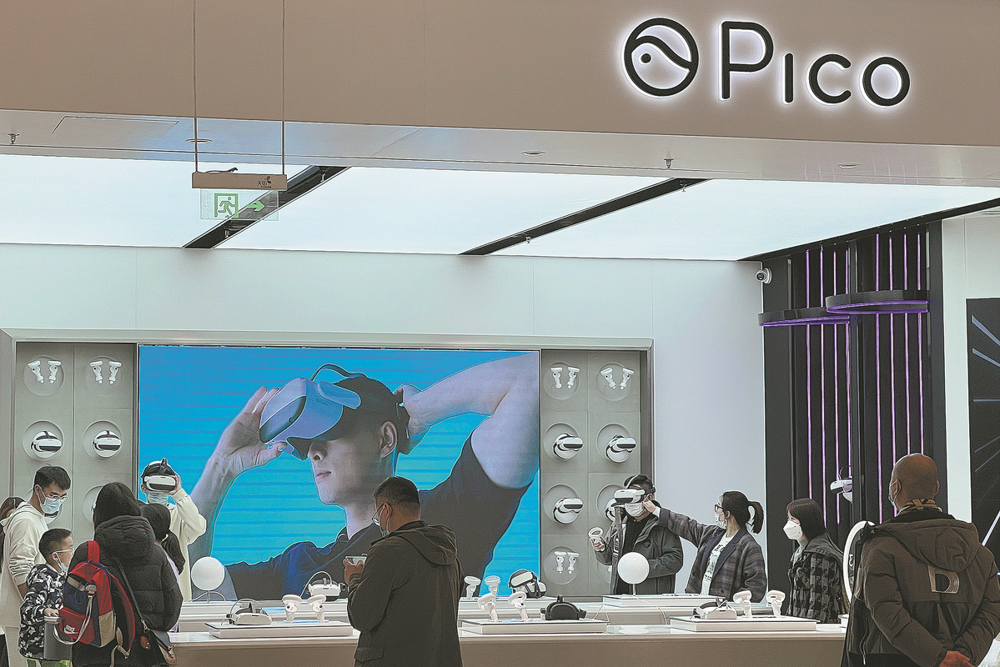
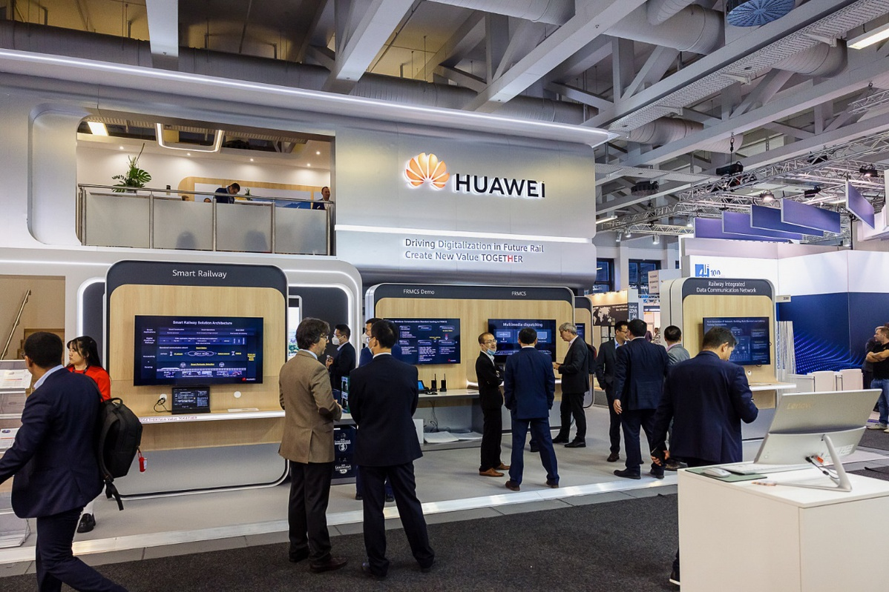
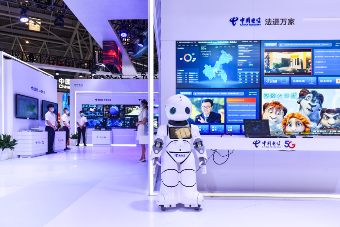

# 中国十大元宇宙公司

互联网杂志《互联网深度》(Internet Deep)发布了中国启动虚拟世界500强企业排名，涵盖应用、硬件、人工智能算法、游戏、人工智能人类、娱乐媒体等领域。

现在，让我们来看看排名前 10 位的元界公司。

**No 10 数字域集团**

Digital Domain Group 的 AI 人类。[照片/截图来自公司微博账号]

**No 9 蚂蚁集团**

2022 年 9 月 3 日，在北京举行的中国国际服务贸易交易会上，一名男子经过蚂蚁集团的展位。[图片/VCG]

**No 8 中国移动**

2022 年 9 月 3 日在北京举行的中国国际服务贸易交易会期间，参观者在中国移动的展台前驻足。[图片/VCG]

**No 7 网易**

2022年9月3日，在上海举行的世界人工智能大会上，一位女士在网易展台拍照。[图片/VCG]

**No 6 字节跳动**

消费者在北京旗舰店选购笔克产品。虚拟现实耳机制造商 Pico 归科技公司字节跳动所有。[图片/中国日报]

No.5 阿里巴巴

2021 年 5 月，一个女孩站在浙江省杭州市阿里巴巴集团控股有限公司总部前。[照片/机构]

**No 4 华为**

2022 年 9 月 22 日，在德国柏林举行的领先交通运输新品交易会 InnoTrans 2022 上，华为展台。[图片提供给中国日报网]

**No 3 腾讯**

腾讯在 2022 年 10 月 22 日在北京举行的博览会上展示技术。[照片/VCG]

**No 2 中国电信**

2022 年 8 月 22 日，中国电信在重庆世博会上的展台。[图片/VCG]

**No 1 百度**

虚拟人主持百度活动。[图片/中国日报]
