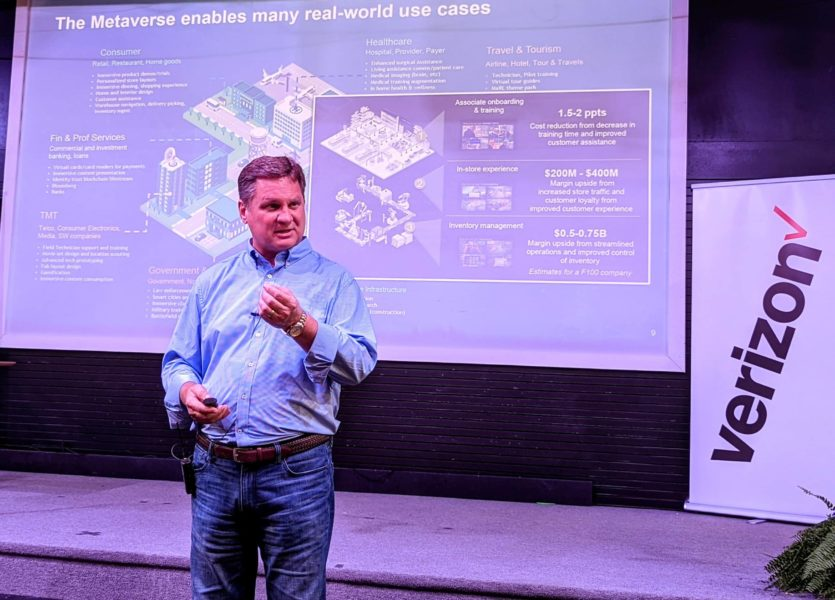
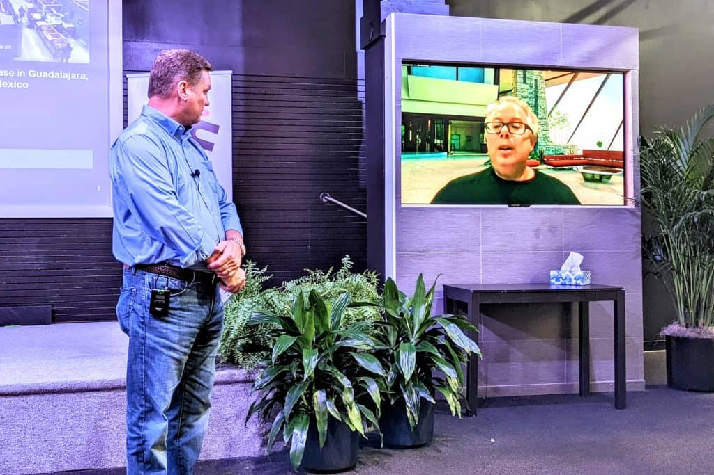
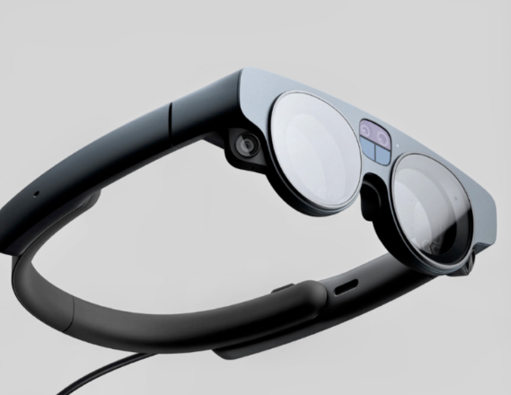

# 元宇宙如何推动坦帕湾的劳动力

波士顿咨询集团高级合伙人 Guy Gilliland 博士强调，元宇宙不仅仅是化身和游戏。马克·帕克的照片。

不仅仅是戴上耳机并悠闲地探索身临其境的虚拟世界，许多商界领袖认为，元宇宙提供了一种培训“蓝领技术型劳动力”的新方法。

[在周四晚上的创新聚会上， Soaring City Innovation Partnership](https://soaringcity.com/)的执行董事 Mark Sharpe表示，每家公司都将很快拥有与互联网和社交媒体一样的元宇宙战略。他指出，变革正在通过 Zoom 会议和虚拟医生预约、新员工入职计划、店面和活动空间进行。

Sharpe 转述说，Soaring City 正在与[波士顿咨询集团](https://www.bcg.com/)(BCG) 合作，使用增强现实 (AR) 等创新技术来建立和培训蓝领技术型劳动力。当保险公司 Florida Blue 的领导层提供了在坦帕大学购物中心[的 RITHM](https://stpetecatalyst.com/unique-incubator-joins-expanding-tampa-tech-development/)（研究、创新、技术、栖息地和医学）中心建造新的 blackboXXcelerator 所需的资源时，他说他们要求 Soaring City 帮助消除世代贫困。

“我们知道它必须是特别的东西，”夏普说。“它必须是非常大的东西，这就是它。”

Boston Consulting Group 的高级合伙人 Guy Gilliland 博士随后开始了本次活动的最后演讲“The Metaverse and You”。[AR 平台Magic Leap](https://www.magicleap.com/en-us/)的创始人 Rony Abovitz虚拟加入了讨论。

AR平台Magic Leap创始人Rony Abovitz（右）参与了与Gilliland的讨论。Abovitz 相信坦帕可以成为蓝领技术型劳动力的领导者。

Gilliland 告诉与会者，BCG 在全球 98 个城市雇佣了大约 20,000 名顾问，并与几乎所有财富 500 强公司合作。他补充说，这种影响力使公司能够识别新的全球行业和发展。

他说，印度和沙特阿拉伯王国目前正在开发广泛的虚拟世界项目，并指出历史上，技术革命使许多人落后。与 Sharpe 一样，Gilliland 认为 Web3 的去中心化方面——互联网的最新版本，也利用了区块链技术——可以作为经济均衡器。

“元宇宙放大了经济，”吉利兰说。“通过创建数字资产，我们使公司和个人能够做的比平时更多；赚钱，找工作。”

Gilliland 强调，元宇宙不仅仅是化身、虚拟现实和游戏。他说，这也是关于利用数据来提高生产力。

然后，他确定了坦帕湾可以在特定行业中利用的几个机会。Gilliland 表示，该地区应采取创新方法来巩固其优势——包括体育、教育、医疗保健和军事相关设施。

Gilliland 转述说，职业运动队已经使用虚拟现实耳机来训练球员和教练。然而，他说人们只能长时间佩戴这些设备，然后才会感到恶心。他说，AR 减轻了这种副作用，因为它允许用户看到外面的世界。

Gilliland 认为，建立一支“技术人才队伍”来支持部署新兴技术所需的研究将使坦帕湾在新的就业生态系统中蓬勃发展。以激光技术的劳动金字塔为例，他说 AR 和沉浸式培训将塑造劳动力的各个层面——从没有大学学位的手动和机器人装配技术到拥有光子学博士学位的设计师。

他表示，如果该地区成为构建新技术生态系统的独特领导者，则可以创造 375,000 个就业机会和 500 亿美元的经济影响。

“问题是，值得吗？” 吉利兰说。“是的，这些数字上有正确数量的零，可以让它在这里工作。”

Abovitz 最近发布了他最新一代的增强现实耳机 Magic Leap 2，他讲述了在美国寻找高科技生产型劳动力所面临的挑战

Magic Leap 2 耳机采用增强现实技术，专为延长日常使用而设计。屏幕截图由 magicleap.com 提供。

他解释说，他[与总部位于圣彼得堡的捷普](https://stpetecatalyst.com/jabil-partners-with-magic-leap/)合作，在墨西哥瓜达拉哈拉建立了一家新的 Magic Leap 工厂，该市帮助该公司找到并培训了数千名员工。然而，他指出在佛罗里达州获得这种支持水平的困难。

虽然他的公司能够将制造业从中国转移到这个半球，但 Abovitz 希望当地的利益相关者能够帮助创建在坦帕湾建造这些设施所需的生态系统和人才库。他说，利用具有人工智能功能的轻量级 AR 系统，比如他的 Magic Leap 平台，可以提供一个持续的培训周期，实时提高工人的技能。

“它为您提供了一种前所未有的真正独特的蓝领技术工作者，”Abovitz 说。“而且我们认为坦帕可能会占据主导地位。”
