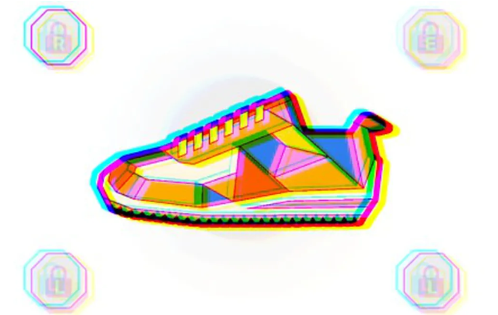

# Stepn 母公司推出 NFT 市场

Find Satoshi Lab 是移动赚钱应用 Stepn 的母公司，正在发布 MOOAR，这是一个基于会员的多链[不可替代令牌](https://www.coindesk.com/learn/what-are-nfts-and-how-do-they-work/)(NFT) 市场。

市场的加入有助于公司与现有的 Stepn 健身应用程序和基于 Solana 的去中心[化交易所 (DEX)](https://www.coindesk.com/learn/what-is-a-dex-how-decentralized-crypto-exchanges-work/)的 DOOAR 一起开发其自我维持的生态系统。

MOOAR 用户不仅可以购买使用 Stepn 所需的运动鞋（目前的底价为 0.98 SOL，或[Magic Eden](https://magiceden.io/marketplace/stepn)上约 32 美元），还可以在平台上构建和销售 NFT 收藏品。该平台在新闻稿中写道，目标是让这三个应用程序“协同工作，积极相互支持”。

值得注意的是，该平台以零平台费用和无可选版税的方式启动。

在过去的两个月里，NFT 平台[X2Y2](https://www.coindesk.com/business/2022/08/31/an-nft-marketplace-is-letting-buyers-avoid-royalty-payments-creators-arent-pleased/)、[Magic Eden](https://www.coindesk.com/business/2022/10/15/magic-eden-moves-to-optional-royalty-model/)和最近的[LooksRare](https://www.coindesk.com/web3/2022/10/27/nft-marketplace-looksrare-switches-to-optional-royalties/)都放弃了在购买代币时向创作者支付版税的要求。

Stepn 的首席运营官 Shiti Rastogi Manghani 告诉 CoinDesk，不能长期支持艺术家将损害 NFT 的价值，而 MOOAR 旨在公平地补偿创作者。

“你已经可以在一些已经开始收取 0% 特许权使用费的平台上看到，交易量的下降趋势是即将发生的事情的迹象，”Manghani 说。“这就是我们采取如此强硬立场的原因，我们希望支持创作者，我们希望在收费结构中执行这一规则。”

打算在 MOOAR 上销售的创作者可以设置 0.5% 到 10% 的版税，默认为 2%。

Find Satoshi Lab 于 2021 年底发布了其旗舰产品 Stepn，报告今年[第二季度的利润为 1.225 亿美元](https://www.coindesk.com/business/2022/07/12/solana-based-stepn-reports-1225m-in-q2-profits/)。6 月，该公司发布了 DOOAR，根据[Dune Analytics 的数据](https://dune.com/twocrows/solana-dex)，它目前在 Solana 上运行的其他去中心化交易所中拥有最多的每日活跃钱包。
