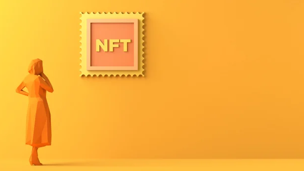

# NFT 坚决反对加密货币的回旋

在近期市场波动的背景下，NFT 的世界正在经历某种程度的整合。

AFL 最近透露将发布一批新的 NFT，希望该游戏能够从希望购买现代交易卡的数字等价物的收藏家身上获利；而 eBay 收购了 NFT 市场 KnownOrigin 以帮助其客户交易数字资产。

NFT 正在创造新的交易方式。iStock 

同时，毕马威推出了元界协作中心，以帮助其客户“操作他们的元界之旅”；总部位于澳大利亚的全球 NFT 市场 Magic Eden 筹集了 1.87 亿美元，总估值超过 20 亿美元。

加密货币和 NFT 交易所 Bybit 的加密洞察负责人 Charmyn Ho 表示，NFT 背后的概念有可能彻底颠覆我们交易以及提供商品和服务的方式。

“当前的‘Web2’互联网的一个问题是它使一切都可以替代——内容或 IP 可以无限复制，这会贬低资产和具有创造性的价值项目，例如音乐和写作，”何说。

“通过使事物不可替代，NFT 找到了一种在互联网上代表稀缺性的方法。只有一个 NFT 和一个所有者。”

她说，他们正在创造新的交易方式。

“NFT 以数字方式代表区块链上的所有权，这意味着只需点击几下即可独立验证所有权和出处，并且可以与全球任何人进行数字化交易，”Ho 说。

“NFT 可以用作贷款的抵押品，甚至可以捆绑到一个金库中，其中发行的代币由金库的价值支持，类似于黄金 ETF。”

“我们预计 NFT 将在未来取代合同和契约。例如，房地产所有权将通过在各方之间转移 NFT 来授予。”

此功能已用于当前的 NFT 作物，其中昂贵的 NFT 被用作贷款的抵押品。然而，理论上，这个过程可以用于任何事情。

“大规模采用的主要障碍是监管和数字基础设施的发展以适应该技术，这将需要一些时间。”

Bybit 最近发布了 GrabPic，允许该公司提供来自加密原生和传统艺术家、GameFi 和元界项目的独家 NFT 项目。

“它是 Bybit NFT Marketplace 上的一个专业门户，允许艺术家以最小的技术障碍进入 NFT 空间，”她说。

## 创新超过投资者

2022 年，Bybit 成为 F1 车队甲骨文红牛车队的主要加密合作伙伴。

该公司已与 Oracle Red Bull Racing 推出了多个 NFT，包括在摩纳哥大奖赛上的 Playseat 拍卖，获胜者赢得了实体游戏座椅和 NFT 游戏座椅。

“对于我们今年的年度世界交易系列活动，我们增加了创纪录的 800 万美元奖池，提供了 1000 多个 NFT 奖金，其中包括 CloneX 和 Mutant Ape Yacht Club NFT 等“蓝筹”系列。”

何说，由于 NFT 是如此新，因此突出投资者的机会并建立信任和保证是首要的。

“这意味着非常需要教育和意识，”何说。

“在任何新兴市场，尤其是数字市场，创新速度都可以迅速超过投资者和监管机构。”

“这取决于像 Bybit 这样值得信赖的参与者，引领潮流，突出巨大潜力，并为投资者和贡献者提供一个安全和值得信赖的市场。这正是我们正在做的事情。”

NFT 的真正机会在于它们将继续存在。

“现在是学习和领先一步的理想时机，”她说。

她说，2021 年，全球 NFT 市场为 155.4 亿美元，预计到本十年末将超过 2100 亿美元——复合年增长率为 33.9%。

“这是由于全球对排他性的需求不断增长。NFT 是独一无二的、透明的，不能在多个所有者之间分配——这也有助于降低伪造 NFT 的风险并确保买家的安全。”

至于在哪里投资，就像任何潜在波动的市场一样，有无限的低买高卖机会以及稳定的口袋，她说。

“数字艺术市场是最稳定的，而流动性高的‘蓝筹股’NFT 很可能保值。

“由于其中一些收藏品的价值与五居室房屋相同，因此也有追踪 NFT 收藏品的 ETF，这可能是接触这一新资产类别的好方法。”

## 尽职调查

Ho 表示，NFT 为满足各种风险状况的澳大利亚投资者提供了许多机会。

“在 6 到 23 个月的短期内，与任何可能波动的市场一样，都有无限的低买高卖机会以及稳定的空间。

“数字艺术市场是最稳定的，而流动性高的‘蓝筹股’NFT（如 Cryptopunks、World of Women 和 Pudgy Penguins）可能会升值。

“最后，随着世界转向 Web3 和元界，NFT 将进一步发展，凭借其超越现实和虚拟世界的独特能力，提供排他性和参与性，并提供更大的有形和内在投资潜力。”

何说，无论你是投资者还是艺术品收藏家，你很快就会熟悉 NFT。

“NFT 为人们买卖创意作品、享受粉丝俱乐部会员资格、获得独家门票以及可能在不久的将来登记财产交易提供了一种创新且引人入胜的方式，有望成为 Web3 未来关键基础设施的一部分。”

澳大利亚区块链最高机构、Piper Alderman 的数字资产律师 Michael Bacina 表示，NFT 空间“可能是使用区块链和 Web3 的最令人兴奋的发展”。

“作为收藏品出售的不可替代代币很容易识别它们的本质。例如，一位著名足球运动员的数字收藏卡很容易与我们许多人在童年时期积累的实体收藏卡相媲美，”Bacina 说。

他说，分散融资是一场即将到来的“大规模运动”。

“已经有许多项目试图分割房地产和电影资金。

“我们看到一些涉及 NFT 的非常有创意的想法出现，包括将实际电影的数字帧作为收藏品预售。

“同样，有些音乐平台希望使用 NFT 创建自动许可，以使版权批准和使用更便宜、更快捷。”

他敦促任何考虑收集 NFT 的人“认真对待”并了解他们正在购买什么。

“对于那些努力了解他们正在收集什么以及未来可能流行什么的人来说——也许他们可以在原石中找到钻石，”他说。

“但这绝不是一个快速致富的计划。大多数 NFT 收藏品的价值都在下降，而要找到那些可能会上涨的收藏品需要时间和专业知识。”

“在收藏品领域，NFT 在很多方面都与比特币和加密货币众所周知的波动性相反，主流数字收藏品是加密领域令人兴奋的新产品。”
