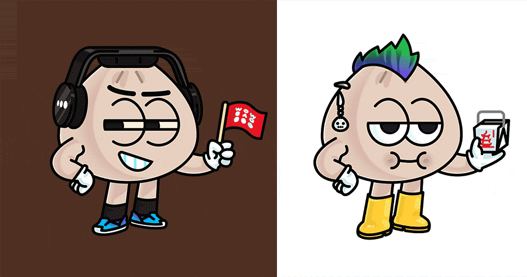

# WOW BAO 公布了在虚拟世界中插旗的计划

技术仍在不断发展，消费者的兴趣可能会有所不同，但首席执行官 Geoff Alexander 希望将这个主要是虚拟的快速休闲品牌放在元地图上。

技术领先的 Wow Bao 连锁店周三启动了进入元界的第一阶段。

总部位于芝加哥的快速休闲亚洲概念店将扩展其 Bao Bucks 奖励计划，以添加基于 NFT 的访问通行证，该通行证将于 2023 年初推出，不过粉丝现在可以加入等候名单。NFT 的持有者将被授予进入俱乐部的权限，他们可以获得虚拟餐饮奖励，并参与每月的赠品和独家折扣。

Wow Bao 的总裁兼首席执行官 Geoff Alexander 表示，这个想法是提供一系列数字收藏品，在这种情况下，这些是具有不同功能的小 bao 角色，具有层层优势。将分为三个等级，最高等级可获得更多福利。

Alexander 说，与现有的 Bao Bucks 计划不同，后者更直接地提供奖励，NFT 此举旨在建立更多的社区。

他说，这个想法是通过提前获得新口味发布的机会来与客人展开对话，或者询问他们接下来想看什么。“这是忠诚度的下一阶段。”

Wow Bao 计划最初铸造大约 2,500 个 NFT，但 Alexander 表示可能不会限于这个数字。价格尚未确定，但目标是使其易于获得，起始价格在高个位数或低两位数。

“当你只做这么多东西时，就会有很多排他性。但我们希望具有包容性，”亚历山大说。

而且，与早期版本的 NFT 产品不同，买家不需要使用加密货币来认领它们。Wow Bao 的 NFT 可以使用信用卡和电子邮件地址购买。

在战略的下一阶段，Wow Bao 计划在虚拟世界中推出他们的热食自动售货机的虚拟化身。

目前尚不清楚哪些游戏或平台可能会承载虚拟自动售货机，但亚历山大表示，目标将是让那些在虚拟世界中玩耍的人接近自动售货机并购买可以在现实生活中交付的宝。

虚拟世界版的自动售货机灵感来自哇宝的真实自动售货机。该概念目前包括乔治亚州、佛罗里达州和拉斯维加斯的大约 25 台自动售货机。这些售货亭采用自动化零售技术开发，主要在非传统地点扩展，并提供一系列现点现做的冷藏饺子。

Wow Bao 的 metaverse 战略是与客户情报和咨询公司 Brightloom 共同开发的，它还将包括作为汽车和锦标赛赞助商出现在赚钱的赛车游戏 Riot Racers 中。粉丝可以购买哇宝赛车在游戏中比赛，但该品牌也在为平台内的玩家计划各种促销和赠品。

Wow Bao 长期以来一直是技术先锋，作为最早在 2010 年推出自助点餐机的连锁店之一，并在 2017 年推出了全自动的 cubby 取货体验。该连锁店还使用幽灵厨房策略在全国发展到 600 家门店, 在一些市场，哇宝正在利用像 Reef 或 Kitchen United 这样的商业幽灵厨房来实现增长，但绝大多数门店都是通过将 Wow Bao 作为仅送货品牌提供额外收入的其他餐厅。

例如，仅在 10 月，就有 100 多家虚拟 Wow Bao 网点上线，其中包括与 TGI Fridays 的大量交易，Alexander 说。

Wow Bao 加入了越来越多采取 Web3 举措的品牌，尽管有证据表明消费者并不像最初预计的那样对玩元宇宙感兴趣。尽管如此，Chipotle、Wendy's、Applebee's、IHOP 和 White Castle 已经尝试将他们的品牌插入虚拟世界或销售 NFT。

亚历山大说，有些人对元宇宙非常感兴趣，有些人则不感兴趣。

“但创新和进化是 Wow Bao 的核心，”Alexander 说。“19 个月后的元宇宙会和今天一样吗？一切都在发展，我们希望成为这种发展的一部分。”
