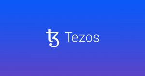

# Instagram 用户很快将能够铸造和销售 NFT

Blockhaus 为世界上一些最知名的公司提供了以 Web3 为重点的营销和传播服务，包括曼联、依云、棒约翰、GAP、纽约大都会队、甲骨文红牛车队和迈凯轮一级方程式车队。 

专注于 Web3 的机构**Blockhaus推出了一款开源 NFT 工具，旨在让创作者和收藏家在WordPress**上铸造和托管环保 NFT 。

**NFT 工具**的名称为 **Minterpress**，由**Tezos 区块链**提供支持，以确保通过 Minterpress 铸造的 NFT 是节能的，没有第一代 NFT 的负面缺点。

WordPress NFT 插件的推出进一步释放了全球创意人员的价值，让他们能够直接从 WordPress 页面铸造和展示他们的作品作为 NFT。

## 不再需要中心化的 NFT 市场

Blockhaus 的 Minterpress 允许艺术家控制他们的作品在他们的 WordPress 网站上的显示方式，而不必依赖集中式 NFT 市场来推销他们的产品。

Minterpress 不需要任何编码知识，因为艺术家可以简单地创建一个 NFT 画廊以在他们的 WordPress 网站上展示，或者提供一个 NFT 市场的链接来购买他们的作品。

通过为创意人员简化 NFT 的铸造和展示，Minterpress 进一步推进了 Blokhaus 的使命，Blokhaus 是一家专门从事区块链和 web3 计划的营销和传播公司。

Tezos 区块链是用于在 Minterpress 平台上铸造所有 NFT 的底层技术。Tezos 以其节能设计和铸造和交易 NFT 的低成本而闻名。

Tezos 的 NFT 友好能力吸引了世界各地的艺术家、收藏家和建设者组成的多元化 NFT 社区，包括主要的 NFT 平台 Objkt.com。

Blockhaus 为世界上一些最知名的公司提供了以 Web3 为重点的营销和传播服务，包括曼联、依云、棒约翰、GAP、纽约大都会队、甲骨文红牛车队和迈凯轮一级方程式车队。
