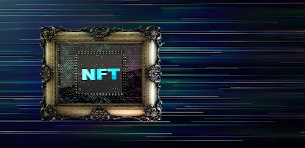

# 解释：NFT 股票及其运作方式

如今，不可替代的代币或 NFT 已经达到了 2016 年加密货币所处的位置——大多数人都知道它们的存在，但并不完全确定它们的效用或潜力。当谈到 NFT 时，引起人们注意的是所有涌入新生领域的资金。去年，每一位摇滚明星、体育俱乐部或任何人都推出了自己的 NFT 收藏，并推动 NFT 市场飙升。

结果是一个很快就会破裂的泡沫。如今，OpenSea 上 NFT 的交易量已从峰值减少了 99%。我们还听到去年定价数百万的 NFT 的故事，现在价值不到几百或几千美元。

**那么，这是 NFT 的终结吗？是和不是。**

是的，这可能是盲目创建、购买和出售不合逻辑的高额 NFT 的终结。你可能没有听说过太多无缘无故定价不合情理的 NFT 案例。

但不，这不是 NFT 的终结。它们肯定会变得更加实用，您可以放心，大多数人不只是购买 NFT 以将它们出售给以后会支付更多费用的人。此外，它还将带来投资这些数字资产的新方式，包括 NFT 股票。

**什么是 NFT 股票？**

随着 NFT 崩盘让人们对其未来产生怀疑，一种新的投资方式出现了，或许更明智。NFT 股票是指任何积极追求 NFT 相关目标的上市公司的股票，无论是通过创建 NFT 市场、他们自己的收藏还是支持 NFT 的产品。

简而言之，如果 NFT 市场的未来上涨证明对公司的股票价值有利，那么它就是 NFT 股票。

**投资 NFT 股票的优势**

投资 NFT 股票有两个显着优势。首先，这是从 NFT 的兴起中获益的唯一途径，而不会带来随之而来的风险。有了 NFT 股票，您就知道您投资于一家真正了解 NFT 的企业，并且不将其视为高估收藏品的库存，而是作为未来基于实用工具的工具。

你花在 NFT 股票上的血汗钱是有利的，因为上市公司的多元化程度足以不仅仅依赖于 NFT 的采用。如果一家鞋业公司进入 NFT，他们仍然有鞋类销售和其他收入来源来保持股票平衡或飙升。

第二个优势是购买股票而不是 NFT 的简单性。使用 NFT，你应该好好研究、创建钱包、小心钱包的钥匙、支付汽油费、了解市场等等。使用 NFT 股票，您可以省去麻烦，因为该企业有数十个团队致力于了解、开发 NFT 并从 NFT 中赚钱。

**热门 NFT 股票**

下面列出了一些 NFT 股票，对于希望在没有 NFT 风险的情况下通过 NFT 赚钱的个人来说，它们可能是可行的投资。

**Meta**

虽然 Meta 股票的表现是近期历史上最糟糕的，但它仍然是未来的好股票，尤其是在目前被低估的价格下。Meta 正在进行一系列的努力，如果成功的话，可以为其股票带来巨大的利益。例如，Instagram 很快将允许选定的创作者直接在其应用程序中制作和销售 NFT。凭借比地球上任何其他企业都多的用户群和多样化的用户群体，该公司拥有创建独特的 NFT 相关项目的卓越基础。

**耐克**

耐克总是迅速适应当前的趋势。它已经通过其运动鞋创造了收藏品，并与全球体育巨星建立了良好的合作伙伴关系。耐克现在正寻求将其收藏品热潮扩展到 NFT 世界，并且已经推出了热销的收藏品。今天对耐克的投资不仅让你分享他们的 NFT 漏洞，还让你分享他们的全球运动鞋业务。

**易趣**

该公司在 5 月宣布进军 NFT 市场时引起了人们的注意。然而，这一举动并不令人惊讶，因为该平台完全是关于交易独特的收藏品。此外，自宣布以来，eBay 一直忙于建立合作伙伴关系并投资于 NFT 项目。例如，这家电子商务巨头与领先的 web3 NFT 平台 OneOf 合作，发布了与冰球传奇人物韦恩 (Wayne) 合作的限量版 NFT 合集。

**格雷茨基。**

不久之后，在 6 月，该公司还收购了另一个领先的 NFT 市场 Known Origin。就其本身而言，eBay 在全球拥有近 1.5 亿买家，并且处于席卷 NFT 市场的有利位置。

**其他要考虑的 NFT 股票**

Funko 是另一家值得投资的公司。去年，这家收藏玩具制造商推出了名为 Digital Pop 的 NFT 系列！与领先的 NFT 市场 Droppp 合作。最近几个月，该公司还收购了 NFT 平台 TokenWave，并收购了一家名为 Mondo 的收藏品业务。这两项收购都应该使公司在未来处于有利地位。

另一只备受关注的 NFT 股票是 Dolphin Entertainment。该公司提供宣传和营销服务，在过去五年中平均收入增长了 90%，令人印象深刻。最近，该公司决定成立一个名为 Dolphin Digital studios 的专门 NFT 部门，并与加密货币交易所 FTX.US 合作，为体育和娱乐行业开发大型 NFT 市场。

大约在同一时间，该公司还推出了两个 NFT 系列，分别是《生物编年史：流放的外星人》和《冬奥会冬季运动冠军》，这两款产品都在市场上表现出色。

**结论**

NFT 泡沫可能已经破灭，但这些数字资产仍然被认为是不错的投资。此外，通过 NFT 股票，您可以以一种风险较小的方式来投资这个新兴但蓬勃发展的资产空间。如果 NFT 市场表现良好，它也应该会为您的 NFT 股票带来相当大的上涨。请记住，任何投资，无论是 NFT 还是其他，都需要大量研究的支持。众所周知，NFT 市场是不稳定的，无法预测。因此，一个人应该只投资他们愿意完全失去的金额。
