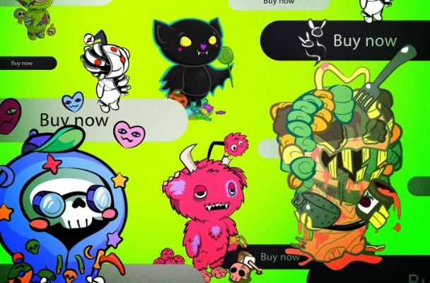
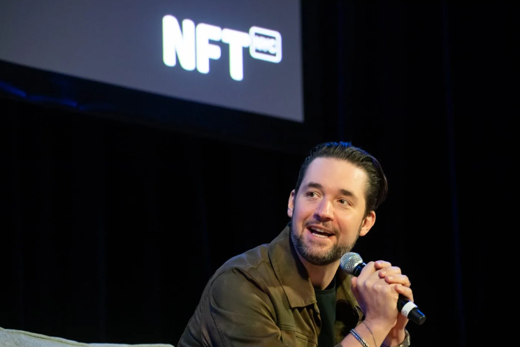

# Reddit 如何挑战 Crypto Winter 并为可定制化身创造了价值 1000 万美元的市场——只是不要称它们为 NFT

美国东部时间 10 月 20 日下午 2:59，当 Reddit[宣布](https://www.reddit.com/r/CollectibleAvatars/comments/y96qqg/trick_treat_ora_little_of_both_spooky_season/)其第二代收藏头像时，Ethan 准备好了，手里拿着电话。

他想尝试在他的台式电脑上购买它们，因为 iOS App Store 抽取了 30% 的分成。一位住在弗吉尼亚州北部的 38 岁平面设计师，为了避免被人肉搜索而要求透露自己的名字，Ethan 不喜欢将收益流向[苹果](https://fortune.com/company/apple)而不是独立艺术家的想法。不幸的是，桌面上的[Stripe](https://fortune.com/company/stripe)信用卡集成对他不起作用，所以他带着他的 iPhone 和[PayPal](https://fortune.com/company/paypal-holdings)账户，准备抢购一些由 Rojom 和 Foustling 等互联网创造者设计的 Reddit 定制 Snoo 吉祥物的 NFT。

当 Ethan 滚动并点击他最喜欢的收藏品时，他的银行打来电话，询问购买是否存在欺诈行为。他试图尽快让他们放心，这样他就可以回到市场上。他最终买了大约 300 美元，他认为这笔钱可以通过二次销售收回，而且他的妻子不会对他大喊大叫——一个 38 岁的男人用真金白银购买在线吉祥物的艺术？真的吗？

Reddit 将其命名为 Spooky Season Collectible Avatars 的疯狂下跌让人回想起大约 2022 年 1 月的加密货币时代更加繁荣，当时 NFT 风靡一时，人们花费数百万美元购买像素化 JPEG戴眼镜的灵长类动物。 

Reddit 的下跌违背了 Crypto Winter 的所有逻辑，其中 NFT 的整体交易量[暴跌](https://fortune.com/2022/08/29/nfts-opensea-crypto-winter-bubble-blockchain-web3/)了 99%。通过允许艺术家创建其签名头像的设计，在与以太坊相关的 Polygon 区块链上铸造它们，并将它们出售给希望将它们作为个人资料图片的用户，Reddit 已将数百万个新钱包加入加密生态系统，并带来数百万美元的收入。销售，同时避免那个可怕的标签：不可替代的代币。

## **'广受憎恨'** 

Ethan 概括了社交媒体平台是如何成功实现这一不太可能的成功故事的。就在几个月前，他花了数百美元购买插图化身，他会和他的妻子有同样的困惑反应。他远非 NFT 粉丝。作为一名艺术家，他对最初的炒作很感兴趣，在 NFT 首次爆发时创建了一个 OpenSea 帐户。不过，他从来没有过多参与。  

他说：“我觉得障碍太高了，这只是一个垃圾拍摄。”

Reddit 明确表示同意。多年来，该平台一直在考虑允许用户自定义其标志性的足球形外星人标志 Snoo 作为他们的化身——Reddit 联合创始人 Alexis Ohanian 告诉*《财富》杂志*，他在 10 多年前首次发布了原型化身构建器。Reddit八年前[推出了一个基本的构建器工具，两年前推出了一个](https://www.reddit.com/r/snoovatars/comments/31n0f4/snoovatars_updated_customize_the_color_of_any/?utm_source=share&utm_medium=web2x&context=3)[更新版本](https://www.reddit.com/r/changelog/comments/jip5qu/announcing_reddits_new_avatar_builder/)。虽然最近的一个与 Reddit 的平台内货币和高级产品集成，但它与区块链技术无关，它允许用户在二级市场上交易和出售它们，除了 2021 年 6 月对四种 NFT 的[短暂试用](https://opensea.io/collection/reddit-cryptosnoos)。

Reddit 的联合创始人 Alexis Ohanian 是可定制头像功能的早期支持者。

迈克尔·纳格尔—彭博社/盖蒂图片社

今年 7 月，情况发生了变化，Reddit[宣布](https://www.redditinc.com/blog/blockchain-backed-collectible-avatars-coming-to-reddit-via-new-storefront)推出“区块链支持的收藏头像”，并将其描述为由独立艺术家设计的 Snoo 吉祥物的限量版演绎，用户可以购买、混合和匹配不同的元素以创建个人资料图片。在将近 800 字的帖子中，Reddit 一次都没有使用“NFT”这个词。 

“NFT 广受憎恨，”一位 Reddit 用户告诉*《财富》杂志。“*只是名字本身就有负面声誉。” 

这是一个精明的举措，让这项技术看起来更容易获得。“在未来，我们将区块链视为为 Reddit 上的社区带来更多赋权和独立性的一种方式，”一位发言人说。“我们正在探索帮助他们更加自我维持和自治的工具。” 

公告帖子用简单的术语详细介绍了区块链的好处。购买者将有权在 Reddit 内外使用艺术品，并且头像将存储在与以太坊兼容的 Polygon 上，这意味着购买者将拥有“所有权和便携性”。换句话说，他们可以在 OpenSea 等二级市场上出售它们。 

Reddit 还采取措施避免 NFT 的一些行话和困难。所有购买都可以使用法定货币进行，用户无需设置加密钱包。相反，他们将使用 Reddit 平台内置的区块链钱包——品牌“保险库”——这些钱包已经集成到平台的其他方面，比如社区积分。 

Ethan 成为 Reddit 用户超过 11 年，但和大多数人一样，他没有注意到 7 月的公告。为了激发更多关注，Reddit 于 8 月开始向高级用户免费[空投](https://decrypt.co/108249/reddit-airdropping-free-polygon-nft-hardcore-users)这些头像，Ethan 看到了这一点，但他仍然保持距离。引起他注意的是 r/avatartrading subreddit 的快速增长，这是一个非官方社区，用户聚集在一起分享技巧并为他们喜欢的艺术品提供报价。  

他开始了解涉及的不同艺术家，甚至加入了 r/avatartrading Discord 服务器，以便与他们聊天。他最喜欢的名字叫 Rojom，他是 Reddit 上的畅销书，他制作了超现实的黑白版本的 Snoo，融合了身体恐怖图案和宗教图像。Rojom 的头像最初在 Reddit 的商店上架时售价不到 100 美元，尽管它们现在在 OpenSea 上的售价为数千美元。 

## **“你真的不需要知道任何事情”** 

Ethan 喜欢他可以使用来自不同头像的不同元素来制作自己的元素。他看到一位名叫 Le Rock 的艺术家拿着一把吉他，他可以在他的头像中使用这把吉他——他自己弹吉他。最重要的是，交易成本或汽油费很低，这是最初使 Ethan 远离 NFT 的障碍。他学会了如何收集他的免费头像，甚至从 7 月推出的第一代中购买了一对，这些头像仍然可用。

“这就是我真正喜欢 Reddit 所做的事情——进入的障碍很小，”Ethan 说。“你真的不需要知道任何关于区块链、助记词或钱包的知识。” 

其他人注意到了：到 10 月 3 日，第一代头像[已经售罄。](https://www.reddit.com/r/CryptoCurrency/comments/xuqfza/reddit_collectible_avatars_are_officially_sold_out/)销售额也在增加：根据Polygon Analytics 的[数据](https://dune.com/polygon_analytics/reddit-collectible-avatars)，总销售额在 10 月 3 日超过 100 万美元，而此前一个月仅徘徊在 40,000 美元左右。

曾经起步缓慢的收藏头像计划被证明是成功的。“还记得当 Reddit Avatars 被认为是一个巨大的失败，每个人都在取笑他们吗？” [在不同的 subreddit r/cryptocurrency 上写了](https://www.reddit.com/r/CryptoCurrency/comments/xuqfza/reddit_collectible_avatars_are_officially_sold_out/)一位用户。“是的，它像保温箱里的牛奶一样陈年。”

与此同时，r/avatartrading subreddit 正在蓬勃发展。其中一位版主因其所持资产的价值而要求被称为“马特”，他于 8 月加入，因为他想弄清楚如何获得他的免费空投。只有少数成员。到 10 月初，已有 3,500 多人。

根据马特的说法，这个社区的开始是因为一些早期的化身系列引起了轰动，比如一个名为 Drip Squad 的系列。用户数量仍然足够小，以至于 r/avatartrading 成员可以舀出其他收藏品，希望它们会飙升。随着市场的起飞，赌注得到了回报，有些人购买化身只是为了立即翻转它们。 

随着 10 月 20 日第二代头像的推出，一切都爆发了，许多最受欢迎的系列在几分钟内就售罄。销售额爆炸式增长，万圣节总销售额超过 1000 万美元。  

“这几乎就像日间交易，”马特说。他说在商店里投入了大约 900 美元后，他拥有大约 60 个头像，总共价值 15 个以太币（约合 23,000 美元）。

问题是炒作周期能否持续。 

专注于加密的风险投资公司 Framework 的联合创始人迈克尔安德森表示，NFT 需要提供超越纯粹投机的价值。“你必须在这些 NFT 中内置核心实用程序，才能让它们在长期内具有可持续价值，”他说。

一个例子是稀有性，它可以作为一种身份象征，就像从马克·库班到帕丽斯·希尔顿的名人所拥有的无聊猿化身。虽然一些 Reddit 头像收藏的铸币数量较少，但这并不是该项目的核心功能，该项目有近 300 万个头像在流通。  

另一个用例可能是提供某种社区价值，例如访问 Reddit 中的不同空间，安德森将其描述为令牌门控。Reddit 的头像也有可能推动新用户与加密生态系统的其他方面进行交互，其中 NFT 仍然是一个妙语。  

在 10 月 18 日 TechCrunch Disrupt 的一次小组讨论中，Reddit 首席产品官 Pali Bhat 透露，超过 300 万个 Redditor 创建了一个钱包或 Vault，并且有 250 万个 Vault 被用来购买一个头像——这个数字增加到近根据 Polygon 的数据，300 万。  

在专门提供给*《财富》杂志*的数据中，OpenSea 表示，自 Reddit 10 月 20 日下降以来，Polygon 上的新用户增加了 75%，Reddit 在过去六个月中带来的新用户几乎是其他任何项目的三倍。此外，在 OpenSea 上进行交易的 Reddit NFT 所有者中有 20% 继续在该平台上购买了另一个 NFT。

“很明显，通过任何必要的方式将新人带入这个领域是件好事，”Framework 联合创始人万斯·斯宾塞 (Vance Spencer) 说。“但是你如何让那些为了[星巴克](https://fortune.com/company/starbucks)礼品卡或 Reddit NFT 进来的人离开并实际使用 DeFi 呢？” 

## **“只是把它们挂起来晾干”** 

r/avatartrading 的版主 Matt 怀疑 Reddit NFT 用户是否会扩展到平台之外，尤其是考虑到社交媒体平台之外的暗淡加密环境。  

“在我们的聊天中，我没有看到很多关于人们想要出去冒险的话题，”他说。“他们为什么会？” 

现在的主要障碍是 Reddit 正在吸引数以百万计的人，否则他们将永远不会与加密货币互动——Reddit 避免任何加密品牌，包括对该行业  [特有](https://fortune.com/crypto/2022/10/13/october-record-3-billion-stolen-in-crypto-hacks-2022/)的诈骗和黑客行为的警告，这一事实强化了这一动态。

马特说，r/avatartrading 的用户成为骗子的目标，骗子诱骗他们放弃恢复短语，让骗子耗尽他们的 NFT。他说，一位用户丢失了价值数千美元的头像。  

版主已采取措施教育用户并邀请可以提供安全和安保教程的客人，通常会通宵达旦地提供支持。马特说，Reddit 在“刚刚加入了这么多新的 Web3 用户和这么多 NFT 用户之后，就一直保持沉默，他们只是把它们挂起来晾干。”

Reddit 发言人表示，r/avatartrading 是一个非官方社区，而是将 r/collectibleavatars 称为官方 Reddit 运行社区，平台发布新闻和更新。

尽管处于未经批准的状态，但 10 月 25 日，r/avatartrading 的会员人数超过了 10,000 名。来自弗吉尼亚的平面设计师伊桑只能惊讶地看着。  

“我个人最后一次看到这样的一夜增长，”他说，“是 r/WallStreetBets 与[GameStop](https://fortune.com/company/gamestop)的东西。” 
