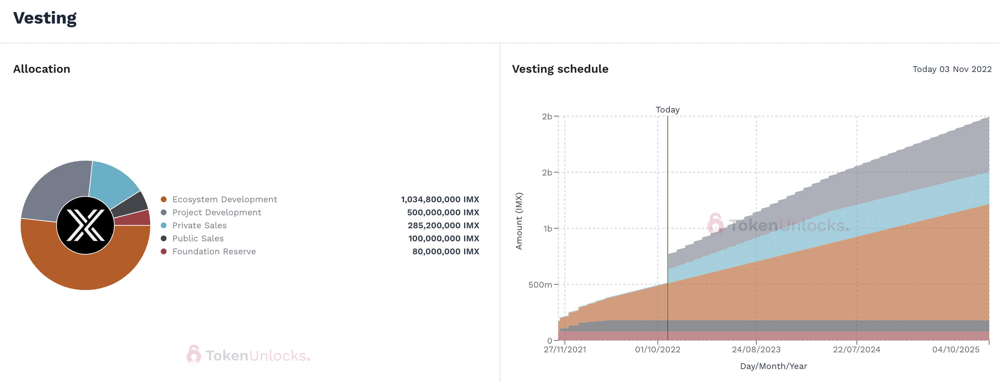
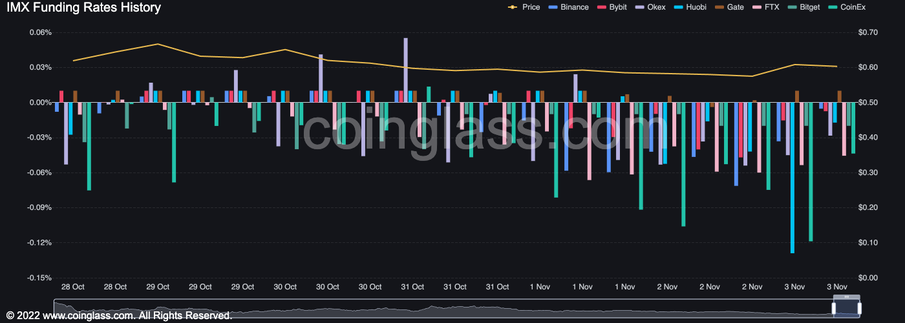

# NFT 平台 ImmutableX 的 6600 万美元解锁织机，给 IMX 代币带来抛售压力

[ImmutableX](https://www.immutable.com/)是一个不可替代代币的平台，将在一次解锁活动中释放价值 6600 万美元的[IMX](https://www.coindesk.com/price/immutable-x/)代币，这将使早期的私人投资者能够出售他们的部分资产，并有可能降低代币的价格。

ImmutableX 发言人告诉 CoinDesk，总共有 1.1 亿 IMX，占代币总供应量的 5% 以上，将免于归属。

归属代表公司股票或加密项目代币的投资者无法出售其资产的时期。随着归属期到期，投资者可以放弃所持股份，从而对资产价格施加抛售压力。

据该公司称，解锁时间为 11 月 5 日星期六 13:00 UTC。

IMX 最近的交易价格为 60 美分，这意味着如果这些私人投资者决定出售，他们的早期投资可能会获得 500% 的利润。

Immutable 的联合创始人 Robbie Ferguson 在一封电子邮件中写道：“我们没有看到围绕即将到来的解锁的担忧，即使会出现一些短期抛售。” “占剩余代币 85% 的前 30 名 IMX 持有者已承诺持有，其中许多人是 Immutable 的长期股东。对于希望出售的剩余 IMX 私人销售持有人，包括 Coinbase 和 Kenetic Capital 在内的新投资者已排好队以吸收任何抛售压力。”

[TokenUnlocks](https://token.unlocks.app/immutable-x)是一个跟踪加密令牌解锁的网站，其数据略有不同。据该网站称，2.55 亿个 IMX 代币（占代币总供应量的 12% 以上）将于 11 月 5 日解除归属。约 1.2 亿个代币属于私人投资者。发言人说，另外 1.35 亿用于项目开发，ImmutableX 已经承诺至少再锁定一年。

大约 2.85 亿个 IMX，占代币总供应量的 14%，以私人销售的形式出售。首批 1.1 亿枚将于 11 月 5 日释放。（TokenUnlocks）

ImmutableX 使用户能够在以太坊区块链上更便宜、更快地创建和交易不可替代代币 (NFT) 。以太坊以其高昂的交易成本（即所谓的汽油费）而闻名，有时高流量会阻塞网络。视频游戏连锁店 GameStop使用 ImmutableX 平台建立了自己的 NFT 市场，该平台于本周上线。

该项目的母公司，总部位于澳大利亚的 Immutable，在风险投资融资 轮次中从私人投资者那里筹集了 2.6 亿美元，其中包括来自Sam Bankman-Fried 的 Alameda Research]、新加坡国家投资基金淡马锡和中国科技巨头腾讯。

即将发行的 1.1 亿 IMX 与代币于 2021 年 11 月出现在加密货币交易所之前发生的私人代币销售有关。这些投资者以大约 10 美分的价格购买了 IMX，根据[CryptoRank](https://cryptorank.io/ico/immutable-x)上的数据，加密货币价格和分析地点。

## 预期波动

解锁事件为市场注入波动性，吸引交易者的注意力从突然的价格波动中获利。

数据显示交易员押注 IMX 的价格将随着解锁的临近而下跌。根据 Coinglass 的说法，大多数加密货币交易所的资金费率转为负值，这意味着交易者绝大多数都定位于做空代币，并将寻求从潜在的价格下跌中获利。

几乎所有主要加密货币交易所的资金费率都变为负数。（硬币玻璃）

最近，加密游戏项目Axie Infinity经历了一场大规模的解锁活动，在 10 月下旬释放了 2.15 亿美元的 AXS 代币。由于预期解锁，AXS 的价格在一周内下跌了 24%。然后，当 Axie 开始发行代币时，空头挤压突然将价格推高 7%，平仓了 160 万美元的空头头寸。

[根据CoinGecko的数据， ](https://www.coingecko.com/en/coins/immutablex)[IMX](https://www.coindesk.com/price/immutable-x/)最近的交易价格为 60 美分，在过去 24 小时内上涨了 4%，比 2021 年 11 月的创纪录高点下跌了 93% 。
