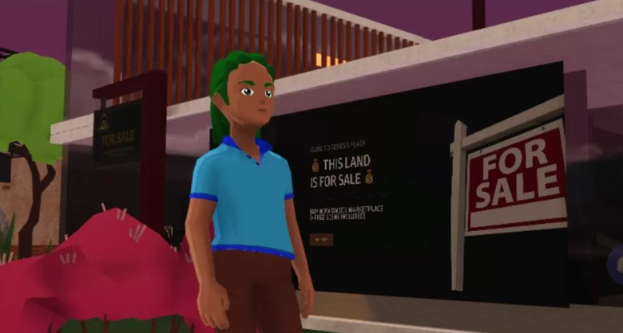
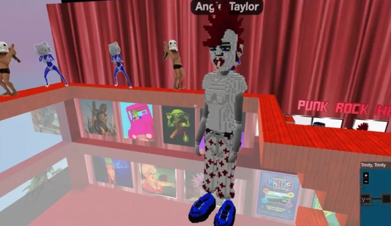
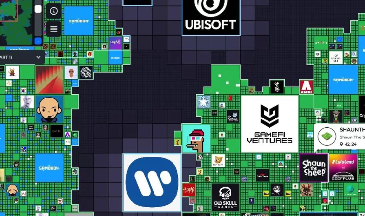
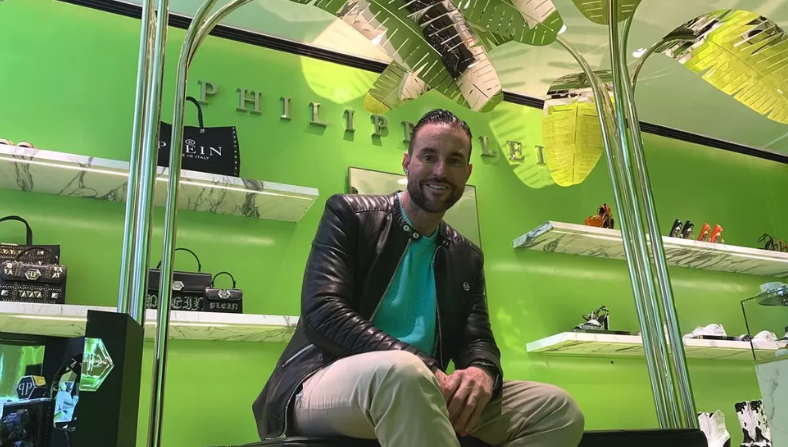
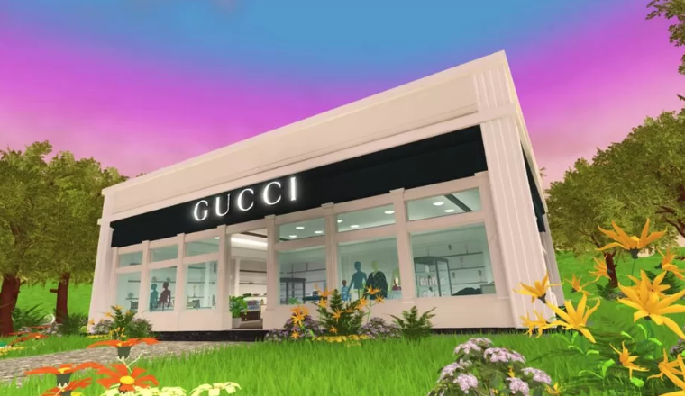
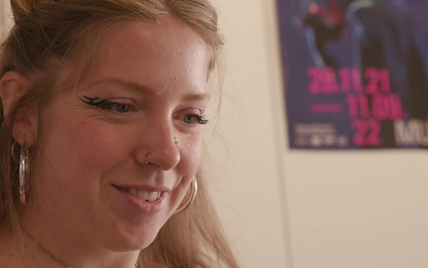
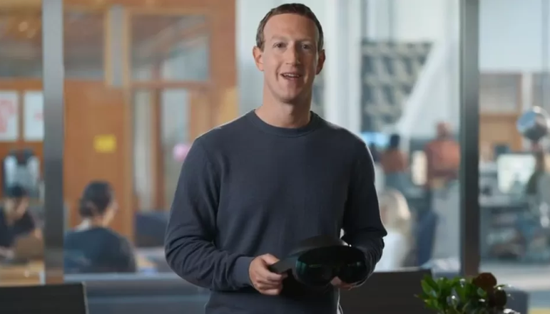

# 数十亿美元用于虚拟世界土地掠夺

**研究显示，在过去 12 个月里，随着人们和公司竞相在虚拟世界中站稳脚跟，近 20 亿美元（17.5 亿英镑）已花费在虚拟土地上。**

但我们距离虚拟世界成为一个单一的沉浸式在线空间还有数年的时间，人们可以在虚拟现实中生活、工作和娱乐。那么抢地是一场豪赌吗？

## “展示我自己的作品”

艺术家安吉·泰勒的头像带着她巨大的深红色莫西干和永久性香烟，看起来不像一个典型的土地大亨。但她是越来越多声称拥有新虚拟世界的人之一。

“我在 2020 年 7 月买了我的第一个虚拟世界包裹，花了大约 1,500 英镑。我买它是为了展示我自己的作品，也是为了举办虚拟世界活动来宣传我的艺术和其他人的艺术，”她说。

来自布莱顿的 Angie 在她位于 Voxels 世界的土地上建造了两个画廊，里面摆满了奇怪而美丽的数字艺术品，这些艺术品以加密货币出售。

图片来源，体素

图片说明，Angie Taylor 在 Voxels 中创建了自己的头像服装

Angie 的情节大约是一个小型家庭住宅的大小（如果将它们与她的化身的大小进行比较）。最高的一栋跨越三层楼，有一个屋顶露台，有一条黑白条纹的马路交叉口，还有一辆粉红色的出租车来回行驶，只是为了好玩。

但是你可以从空中真正感受到这个世界的规模。

“按住 F 键，你可以飞起来看看我的邻居，”安吉解释道。在她的画廊上方，您可以看到数千个相同的土地延伸到地平线。

体素是数十个将自己描述为元节的虚拟世界之一。这令人困惑，因为人们经常谈论“元宇宙”，好像只有一个。但在一个平台开始占据主导地位，或者这些不同的世界结合在一起之前，公司都在以自己的版本出售土地和体验。

图片来源，沙盒

图片说明，过去六个月，数十个主要品牌在沙盒地图中购买了地块

Metaverse 分析师 DappRadar 的研究人员表示，仅在过去一年中，价值 19.3 亿美元的加密货币就用于购买虚拟土地，其中 2200 万美元用于购买 Voxels 中的约 3,000 块土地。

DappRadar 可以监控这一点，因为 Voxels 建立在以太坊加密货币系统上，在该系统中，与所有虚拟货币一样，每笔交易都被记录并发布在公共区块链上。

最受欢迎的世界之一是卡通化的 Decentraland。那里的地块于 2020 年推出，售价为数千美元，有时甚至数百万美元。三星、UPS 和苏富比都在那里购买了土地并建造了商店和游客中心。

奢侈时尚品牌 Philipp Plein 还拥有一块大约有四个足球场大小的地块，它希望最终将包含一个元界商店和画廊。

图片说明，Philipp Plein 计划在他位于 Decentraland 的土地上建立一家大型服装店

然而，业主普莱恩先生表示，他的妈妈对他 150 万美元的购买并不信服。

“我妈妈打电话给我说，‘你做了什么？为什么？你疯了，为什么要花这么多钱，这是什么？’”他说。

一年多来，Plein 先生一直在网上以 24 种不同的加密货币销售商品。2022 年初，他在伦敦老邦德街开了一家新店，出售服装和一些不可替代的代币 (NFT)，以换取比特币和以太坊等加密货币以及英镑。

他说开设这家商店帮助他更多地了解了虚拟世界，并补充道：“我迈出了大胆的一步，在一块土地上花了这么多钱。

“但我在想，我的品牌已经经营了 24 年，如果我重新开始，我该怎么办？”

然而，随着加密货币价值的普遍崩溃，Dapp Radar 表示元界房地产价值接近一年低点

在 Sandbox 中，另一个加密虚拟世界，阿迪达斯、雅达利、育碧、币安、华纳音乐和 Gucci 只是一些跨国公司购买土地，并建立经验来销售和推广他们的产品和服务。

Gucci 还内置了 Roblox，与 Minecraft 和 Fortnite 等其他大型游戏平台一起，被视为新兴元宇宙中最主流的。

图片来源，古驰

图片说明，在 Roblox 上的 Gucci Town，玩家可以使用游戏内货币 Robux 为他们的头像购买服装

这些游戏公司不出售土地，并且在不使用任何区块链技术的情况下运营。然而，他们已经拥有了科幻作家所说的我们需要一个真正的元宇宙的一些关键要素：

- 闲逛和玩耍的能力
- 他们自己的世界货币
- 在平台上赚钱的机会
- 巨大的繁荣社区

Gucci Town 自推出以来的一年内访问量已超过 3600 万，而 Nike Land 在 11 个月内的访问量已超过 2500 万。在古驰小镇，玩家可以用真金白银为自己的头像购买服装。在Nike Land，他们可以通过玩游戏获得积分来获得用于化身的T恤和鞋子。

时尚似乎是最热衷于把握与元宇宙相关的机遇和风险的行业。

位于阿姆斯特丹的纯数字时装屋 The Fabricant 只为化身制作服装，为 Decentraland、Sandbox 和其他加密虚拟世界的用户设计系列和定制服装。

图片说明，Amber Jae Slooten 预测数字服装将会有一个“大众市场”

“当我们开始时，每个人都说我们疯了，因为他们就像，'你为什么需要这个？'。但我们非常相信未来人们会佩戴数字产品的想法，”联合创始人兼首席设计师 Amber Jae Slooten。

迄今为止，Fabricant 的创纪录销售是一件售价 19,000 美元的数字连衣裙，尽管它是作为 NFT（一件数字艺术品）出售的，并且没有被所有者的化身穿着。

该公司刚刚从投资者那里筹集了 1400 万美元的资金，他们认为我们中的许多人很快就会在元宇宙中过上我们生活的一部分。

但不确定是否以及何时会发生。加密元节通常人口稀少，只有在举行活动时才真正使用，即使这样也只有数千人，而不是数百万人参加。

图片来源，Meta

图片说明，马克·扎克伯格的 Meta 自从进入元界以来已经在股票市场上损失了数千亿美元的价值

即使在 Facebook 和 Instagram 的所有者 Meta 正在投资数十亿美元的虚拟世界中，泄露的备忘录也显示人们不会待太久。

但斯洛滕女士坚信，随着这些世界的发展，人们会来。

“这肯定会有大众市场，因为如果你想想年轻一代，他们已经在玩游戏了。对他们来说，虚拟和现实之间没有区别。但它仍然需要建立。”
