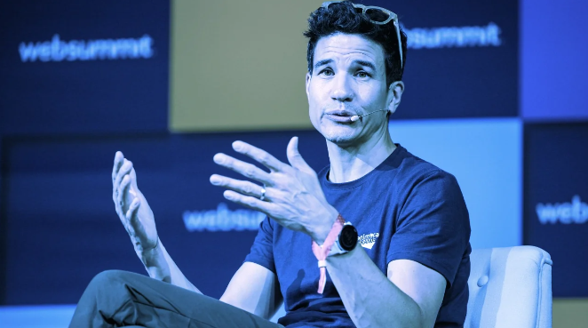

# Animoca Brands 首席执行官：“没有 Web3 就没有元宇宙”

[Metaverse](https://decrypt.co/resources/what-is-the-metaverse-immersive-nft-virtual-world)对许多人来说意味着很多东西，无论是 Meta 的虚拟现实“办公室”、Fortnite 的游戏玩法和社交空间的结合，还是 Decentraland 的 NFT 驱动的虚拟世界。

但对于 Metaverse 投资公司和游戏发行商 Animoca Brands 的首席执行官 Robby Yung 来说，有一个事实是无法回避的。

“没有 Web3 就没有元宇宙，因为你需要有那个事务层，这样你才能在内容之间实现互操作性，并且你可以将它从一个地方带到另一个地方，”他在葡萄牙里斯本 Web 峰会的小组讨论中说。

“作为一个行业，我们正在为此制定标准，”他补充说。“我们已经建立了一些不同的财团来试图解决这些问题。”

Animoca Brands 是[Open Metaverse Alliance](https://decrypt.co/113261/open-metaverse-alliance-says-it-wont-let-meta-define-future-of-the-internet)的创始成员之一，该联盟于本月成立，致力于推动 Metaverse 中的互操作性标准。这些标准将使在一个元界平台上购买的 NFT 内容能够与另一个平台无缝集成，例如，在 Decentraland 上购买的 NFT 可以在沙盒中使用。

但 Web3 领域的一位关键参与者尚未承诺加入开放元宇宙联盟：Bored Ape 游艇俱乐部所有者 Yuga Labs，该公司本周透露，它正在努力制定自己的开放元宇宙 NFT 标准。

Yung 承认，虚拟世界的投资者还有很长的路要走。“我们必须现实一点，这是一个长期计划，”他说。“我的意思是，我们正在构建 3D 互联网，这可能需要 10 年或更长时间。”

## VR是一个“大干扰”

与 Animoca 创始人兼执行主席 Yat Siu 一样，Yung 对 Meta 的元节方法不屑一顾——尤其是它努力创建一个以虚拟现实为中心的元节。“我个人的观点是，我认为 VR 是一个很大的干扰，”他说，并补充说 VR 只是“一个平台”，可以通过它访问元界。

他说，Meta 专注于将元宇宙定义为“类似于 VR”，Yung 将其描述为“一个错误”。

当然，到目前为止，Meta 对虚拟现实的全面进军是一项代价高昂的尝试。上个月，其 Metaverse 部门报告季度亏损 36.7 亿美元。

