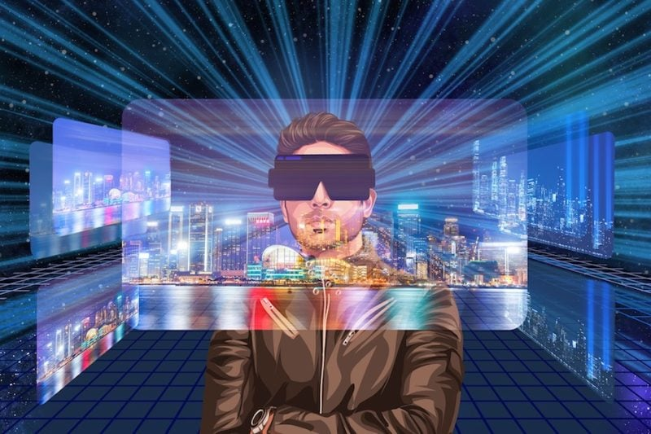

# Virtua 如何准备在元宇宙中实现巨大飞跃

当 Virtua 董事长 Gary Bracey 和我第一次讨论 Virtua 的概念时，它是 2017 年在一家咖啡店。我们在那里讨论了潜在的合作，结合我们在技术、游戏、许可和互动娱乐方面的技能和背景。

我的背景是创建、建立游戏和技术业务。Bracey 是 Ocean Software 的一员，这家游戏公司开创了从 RoboCop 到蝙蝠侠和侏罗纪公园的电影和游戏授权交叉。

这些不同元素的融合形成了一个雄心勃勃的目标，即创建一个将成为元界重要参与者的开创性业务。Bracey 希望为某个项目提供一些咨询，但我说服他加入我的行列，Virtua 诞生了。

快进到 2018 年，我们在 Ready Player One 的筛选中推出了 Virtua。我们以两小时的预告片形式介绍了这部电影，展示了公司在虚拟世界中的雄心壮志。来自不同行业的同行和同事加入了我们的行列，他们分享了我们对该领域的兴趣，包括 Epic Games。

那年晚些时候，我们准备推出完全互动的虚拟环境，这是元节的先驱。但业界对广阔虚拟世界的热情已经减弱，硬件的采用和开发速度都没有与软件同步。

我们专注于数字收藏品，这些物品将成为构建块和观众将带入元宇宙的对象。我们建立元宇宙的长期愿景保持不变。我们确保与可靠的合作伙伴和原创 IP 一起构建优质的 3D 资产，并准备在后期进入虚拟世界。

Virtua 于 2020 年正式进入业务，我们与包括派拉蒙影业和传奇娱乐在内的合作伙伴合作，成功推出了艺术、娱乐和体育项目。

2021 年，当马克·扎克伯格将 Facebook 更名为 Meta 时，世界突然意识到了元宇宙的潜力。该技术已经发展了一段时间，但对于元宇宙初始阶段的预期也变得更加现实。

我们也逐渐了解到，更广泛的受众对去中心化的虚拟世界并不感兴趣，而铁杆行业爱好者认为这是唯一的出路。然而，我们认为元宇宙需要成为一个受控和规范的空间，以供大规模采用。

我们还相信，一个安全的环境将确保人们受到保护，一个品牌乐于开展业务的地方，鼓励互操作性，创建社区并赋予 NFT 实用性。

在 Virtua，我们在开发虚拟环境的同时继续致力于我们的数字收藏品和物品。我们还一直在开发专为虚拟世界设计的游戏，其中数字物品通过 NFT 保留价值。

截至 2022 年，我们已经完成了我们元宇宙的第一次契约销售。卡尔达诺岛启动，我们准备在未来几天迎接契约索赔事件。

我们还建立了几个新的合作伙伴关系，特别是 Williams Racing，作为他们的官方虚拟世界合作伙伴，并与 Kevin Hart 合作。这些元素将作为 Virtua Prime 的一部分结合在一起，Virtua Prime 是我们在 Virtua 元宇宙中的母星，预计将在未来几个月内发射。

从 2017 年咖啡店的简陋开端，Virtua 现在准备在元宇宙中迈出另一个巨大的飞跃。
