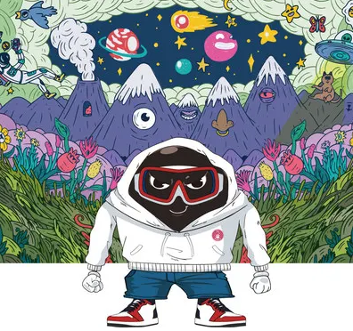

# 国际食品巨头推出新的波霸人 NFT

台湾领先的速食食品制造商 Orbitel International Corp. 宣布计划发布受 boba 启发的不可替代代币 (NFT)。这家食品巨头计划使用其 O's Bubble 吉祥物Boba Man作为该系列的代言人。Orbitel 希望Boba Man通过他活泼的形象激励人们活在当下，享受生活，展现自我价值。

为呼应日益增长的珍珠奶茶大趋势，波霸人的设计元素将结合年轻人的趋势片段，同时融入特色文化元素（景点、文化面貌等），这些元素都与公司的台湾人联系在一起。根。

独特的代币将存放在 Polygon 区块链上，并显示在 OpenSea NFT 市场上。但是，最初它们将无法直接购买。有兴趣的人必须参加 Orbitel 的 NFT 活动才能获得独家 boba NFT 之一。NFT 首次发布后，所有者将能够在二级市场上自由交易代币。

该公司的 NFT 活动将于11 月 7 日开始，一直持续到2022 年 11 月 30 日。所有参与者都将有机会赢得自己独特的波霸人 NFT。欢迎有兴趣的人士访问 Orbitel 的 NFT[活动页面](https://bit.ly/3fFoAqR) 并填写联系信息。从那里，参与者将自动进入获胜。获奖者将于2022 年 12 月 5 日公布。

登陆活动页面后，用户会注意到部分 boba NFT 将与 Gummy Boba 豆奶的四种口味（红茶、红糖、香蕉和草莓）或公司的 Instant Marbling Boba Party Kit 相关联。在获得其中一个 Boba Man NFT 后，用户需要在他们的个人 Instagram 页面和@osbubbletea 上发布他们收到的图像，并带有#bobaman #bobamannft 和#bobaverse 的标签。从那里，O's Bubble 团队的成员将直接联系用户。

**NFT 领域的新玩家**

作为 NFT 领域的新面孔，该品牌希望通过与 GenZ 观众的联系，最终将其对泡泡茶的热爱传播到 Web2 和 Web3 空间，而后者恰好是支持泡泡茶的最大粉丝。该公司最终希望通过其Boba Man吉祥物的独特特征来吸引更多 GenZ 人的眼球。

该品牌引用了已经在 NFT 领域取得成功的大品牌的灵感，例如零售巨头 Gucci 和Louis Vuitton (LV)。两者在 NFT 领域都有很好的成功记录。去年，Gucci 拍卖了一个起价为 20,000 美元的系列。然而，对于普通人来说，boba 系列将更实惠。根据 O's Bubble[活动页面](https://bit.ly/3fFoAqR)，目前价格相当于150 美元左右。

**关于 Orbitel International Corp.**

Orbitel International Corporation 是一家台湾公司，由Gary Tsai在世纪之交创立。

Orbitel 是速食食品的全球领导者，尤其以速溶波巴茶的创新和生产而闻名。该公司的使命是通过其即饮 boba 包装“将 Bobaness 传播到世界的每一个角落”。它在美国发布的即食 boba是该公司近期全球扩张努力的一部分。

然而，Orbitel 的创新不仅限于波巴茶。这家食品巨头还推出了以素食米饭汉堡为特色的 O'scallion 系列。公司提供的所有产品均为台湾知名主食。
