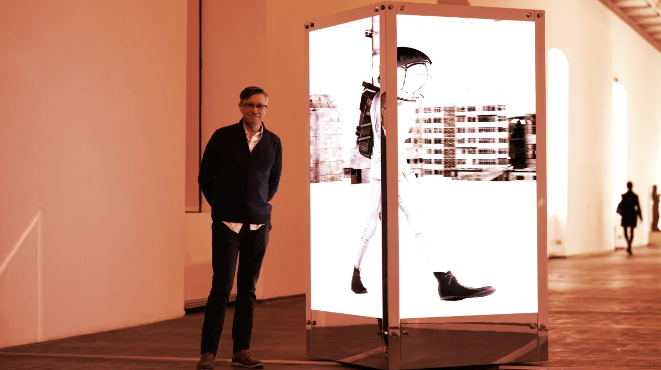

# Metaplex 回溯，在 Solana 上最初宣布 Beeple NFT 后道歉

[NFT](https://decrypt.co/resources/non-fungible-tokens-nfts-explained-guide-learn-blockchain)艺术界的*可怕*魔王 Beeple即将来到[Solana](https://decrypt.co/resources/what-is-solana-a-scalable-decentralized-network-for-dapps)。至少，Metaplex Studios 的首席执行官 Stephen Hess 是 Solana 的 NFT 标准的创建者，他至少是周日在葡萄牙里斯本的 Solana 断点会议上宣布的。

但周一，Mike “Beeple” Winkelmann对这一声明提出异议，在 Twitter 上声称他自己、Metaplex 和 Render Network 之间“没有任何固定或远程商定”。

不久之后，Hess就公司之间的“沟通不畅”公开向 Beeple 道歉，显然证实了 - 至少目前 - Beeple NFT 不会前往 Solana。

“我想在这里真诚地道歉，”赫斯在回应 Beeple 时发推文说。“这是相关组织之间沟通不畅的结果，但这是我在主题演讲中的话，所以我应该直接与你确认同意所宣布的内容。”

Hess 进一步就“我在这里给你、你的粉丝和社区造成的混乱”向 Beeple 道歉。

周一早些时候，OTOY 的创始人兼首席执行官 Jules Urbach（去中心化计算平台 Render Network 的创建者）进一步详细介绍了OTOY、Beeple 和 Metaplex 之间在基于 Solana 的 NFT 方面的合作。

在给*Decrypt*的消息中，赫斯拒绝详细说明合作者之间“沟通不畅”的位置。*Decrypt*还与 OTOY 代表和 Beeple 本人取得了进一步的澄清。

## 索拉纳上的甲虫？

周日，赫斯宣布了将 Beeple 的作品带到索拉纳的交易。“与 Render Network 合作，我们很高兴欢迎 Beeple 加入 Metaplex 和 Solana，”Hess 在 Breakpoint 上说，并补充说 Beeple 将“首次亮相流媒体和沉浸式 3D NFT 的未来”。

赫斯宣布的幻灯片提供了一些线索。用户将被邀请“使用 Beeple Everyday 创建自己独特的 NFT”，使用“随机的一组对象和时间来创建”。（EVERYDAYS: THE FIRST 5,000 DAYS 是 Beeple 的[Ethereum](https://decrypt.co/resources/what-is-ethereum-quickly-explained-four-minute-guide) NFT 仿制品的标题，Beeple 在 2021 年以超过 6900 万美元的价格售出。 ）

周一，在 Beeple 发布推文之前，OTOY 的 Urbach提供了有关Breakpoint 所谓合作伙伴关系的更多细节。“迈克对这项技术感到兴奋，”厄巴赫声称。“明年我们会在某个时候把它放在那里。这就是我们对 NFT 未来发展的看法。”

Beeple 已经与 Render Network 密切合作，担任该平台的顾问，该平台为创作者提供去中心化的点对点网络，让用户可以利用远程渲染能力。

12 月，Render Network在一轮融资中筹集了 3000 万美元，参与者包括 Solana 基金会和 Alameda Research。

自从去年他以 6900 万美元的价格出售 NFT 以来，Beeple 已经涉足代币化物理艺术品，将“动态视频雕塑”与 NFT 配对，并开始在数字艺术工作室工作，以托管他和其他创作者的作品。

今年早些时候，Beeple在接受*Decrypt* 采访时透露，他预计 NFT 将越来越关注“情感联系或效用”，而不是“纯粹的疯狂投机”。

他补充说，在他未来的作品中，“拥有这些东西会有某种效用”，并且他有兴趣探索动态 NFT 所提供的可能性。

