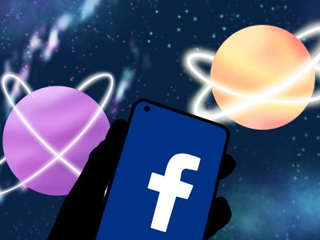

# 扎克伯格的元宇宙与强势领袖的双刃剑 | 天天要闻 金钱很重要

Meta Quest Pro 上个月发布，终于交到了评论者的手中。它确实是迄今为止制造的最先进的消费级虚拟现实头戴设备，头戴设备上带有用于增强现实功能的外向摄像头，以及配备处理器的控制器，这些处理器在智能手机中更适合家用。

激动人心的东西。 

这也是1500美元。 

进入元界的门槛一直很高。没有多少人愿意花数百甚至数千美元购买一台拥有五款好游戏的游戏机。 

那么，马克扎克伯格为什么要向虚拟世界投资数十亿美元呢？他是否看到了我们其他人看不到的东西？

好吧，我个人认为增强现实支持的未来比我们想象的更接近现实。谷歌眼镜可能是过去十年中最酷、最引人注目的技术之一，远远超过可折叠的手机。 

您基本上可以拥有覆盖在现实生活中的图形用户界面或 GUI，就像在视频游戏中一样。可穿戴技术一直具有广泛使用的潜力。 

大多数科技公司都意识到了这一点。 

海莉·阿尔瓦雷斯-劳托 | 图形艺术家

苹果有成千上万的人在开发他们的 AR/VR 头显，索尼和微软已经发布了他们的头显。不管我们喜不喜欢，科技公司的下一个前沿至少将是 AR，或者就 Meta 而言，甚至是 VR。 

Meta 正在开发面向未来的高级耳机。就像三星的 Galaxy Fold 或 Flip 一样，Meta 的前几款顶级耳机对大多数人来说都非常昂贵，而且它们可能会在未来十年内的某个时候降到更合理的价格。 

但投资者还没有准备好等待 Meta 再次盈利。 

自该公司去年宣布将从 Facebook 更名为 Meta 以来，Metaverse 业务亏损超过 150 亿美元。 

到 2022 年为止，该公司的股价已经下跌了 70% 以上。 

然而，随着 Facebook 更名为 Meta，公司也进行了重组。这使得投资者——即使他们持有大部分公开发行的股票——也无法采取任何措施解雇扎克伯格并迫使该公司远离其元界风险投资。 

扎克伯格是唯一可以做出影响公司决策的人。

投资者甚至无法获得真正的多数。Meta 具有双重股权结构，这意味着您的普通乔股东将拥有一种类型的股票，A 类，而扎克伯格和一些内部人士持有另一种类型，B 类。 

A 类股东对一股拥有一票，而 B 类股东每股拥有 10 票，这意味着扎克伯格和其他 B 类股东几乎是无敌的。

扎克伯格拥有该公司 90% 的 B 类股票，这使他基本上是 Meta 的唯一董事。

富有魅力的远见者肯定会推动技术和整个社会的进步。史蒂夫·乔布斯（Steve Jobs）很大程度上归功于为什么我们到处都随身携带矩形玻璃板，他因控制欲极强且难以共事而臭名昭著。

不要误会我的意思，我完全支持元宇宙的未来。我喜欢科技，我喜欢不用拿着和看屏幕就能在手机上的想法。我不反对的是 Meta 处于领先地位，更具体地说是马克扎克伯格。

一家公司不应该是整个技术领域背后的唯一力量，但随着数十亿美元的 Meta 涌入该技术，看起来没有多少其他公司能够与之竞争。
