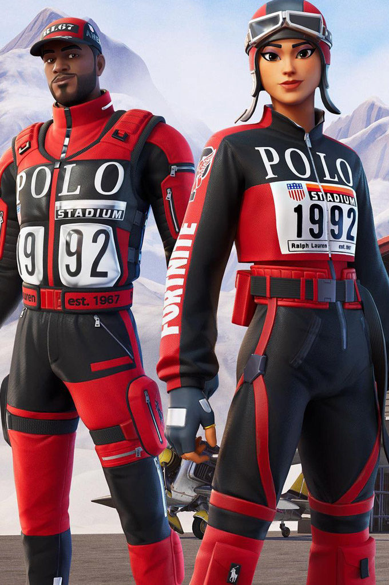
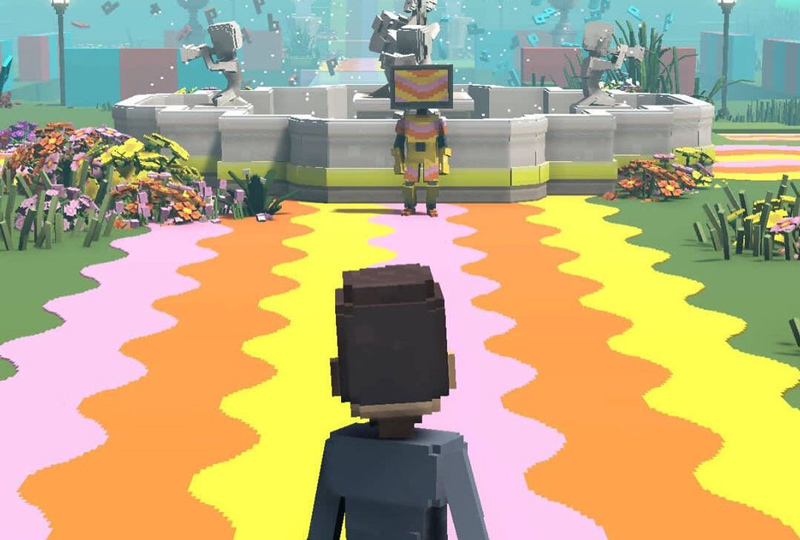

# 时尚元宇宙的最新消息：Rimowa 推出 NFT、Burberry 在 Minecraft 上的胶囊系列等

长期以来，奢侈品零售业的数字化颠覆已证明自己是未来虚拟世界的强大力量。

在The Fabricant 和 Auroboros 等数字时装公司的兴起中，我们发现了虚拟现实的新生阶段，这些时装公司富有想象力地为区块链市场打造超凡脱俗的服装。

对于此类纯数字品牌，他们对高级定制时装的展望已经被设想为虚拟未来，并被编码为成衣系列，您（或您的化身）可以立即在虚拟世界中穿着。 

但是那些长期统治时尚界的奢侈品公司呢？

过去几年见证了他们的虚拟商业模式的显着转变，其中一些被证明比其他模式更具实验性。这场大流行让 Demna 带领 Balenciaga 为其 2021 秋冬系列举办了一场虚拟现实时装秀，同时推出了业界首个名为*Afterworld: The Age of Tomorrow*的视频游戏。

其他品牌——比如 Gucci、Louis Vuitton 和 Prada——也纷纷效仿，开始切入游戏世界。考虑到电子游戏长期以来如何为我们的虚拟未来可能的样子设置借口，这是一个伴随的冒险。 

但快进到 2022 年的倒数第二个月，时尚界似乎在元宇宙中有了明确的立场：一个创意工具和空间，尚未充分发挥其最大潜力。

环保活动家对其与可持续性的轻松结合寄予厚望，并且在虚拟诗句中，它为行业创新合作打开大门的方式受到了广泛的积极欢迎。

最近，Rimowa 推出了带有 RTFKT 的行李箱 NFT，Burberry 推出了带有Minecraft的胶囊 phygital 系列。下面，随着越来越多的创意计划出现在虚拟场景中，收集了时尚元界的最新动态。 

 

由巴宝莉提供

## Burberry 为 Minecraft 打造胶囊系列

Burberry 进一步致力于游戏世界。继之前与 Blankos Block 和电子竞技公司 Gen.G 建立了游戏合作伙伴关系之后，该品牌的最新合作项目是与流行的电子游戏*Minecraft*合作——推出一款名为*Burberry: Freedom To Go Beyond的游戏冒险游戏*. 适应标志性游戏的像素化、块状视觉效果，化身将能够获得 15 种免费皮肤供所有人下载；一些体现了房子的代码，而另一些则倾向于游戏的主题。所有这些都模糊了动画数字景观和现实世界之间的界限，因为人们探索了作为联合合作的一部分而构想的四个新领域。至于 Burberry 实体店，游戏中的场景将排列在墙上，从而增强所有账户的实体体验。

*[在这里](https://sg.burberry.com/l/new-in/minecraft-collection/?brbref=hp_new_in_minecraft_collection)探索 Burberry x Minecraft 胶囊系列。*

由 Rimowa 提供

## Rimowa 推出带有 RTFKT 的行李箱 NFT

与创作者主导的平台 RTFKT 一起，Rimowa 推出了一个新的元宇宙系列：一个限量版的 NFT 系列，可以通过锻造来兑换具有明显赛博朋克影响的实体手提箱，将我们的数字和物理现实融合在一起。加密爱好者有机会沉浸在互动挑战中，该挑战致力于恢复被黑客入侵的 Rimowa x RTFKT 空间站，以铸造他们的限量版 NFT——这将是在真正伪造资产之前采取的必要步骤。除了手提箱的 phygital 版本外，人们还可以访问由他们合作产生的 WorkerBots。

*[在此处](https://rimowa.rtfkt.com/)了解有关 Rimowa x RTFKT 的更多信息。*

@poloralphlauren

## Polo Ralph Lauren 与 Fortnite 合作

看起来 phygital 风靡一时——Polo Ralph Lauren 也采用了他们独家系列的两部分发布形式。游戏成功*Fortnite*是他们的首选战场，合作下降欢迎物理和数字可穿戴设备的完整阵容，尽管在设计上有显着差异。虽然前者由一件中性马球衫和一顶帽子组成——两者都首次展示了重新设计的标志——但后者看到了一系列灵感来自该品牌 1992 年体育场系列的作品。充分融入游戏机制，玩家还可以在游戏中参加马球体育场杯，尝试从数字收藏中赢取物品。

*[在这里](https://www.ralphlauren.co.uk/en/fortnite-lp/707225?webcat=content-fortnite-feat&ab=EU_Fortnite_PLP_Slot_1_S1_L1_SHOP?ranMID=37812&ranEAID=TnL5HPStwNw&ranSiteID=TnL5HPStwNw-H0fgdGbKD_oP7rMTT6sNcw&utm_source=Affiliate&utm_medium=TnL5HPStwNw-H0fgdGbKD_oP7rMTT6sNcw&utm_campaign=TnL5HPStwNw&SiteId=TnL5HPStwNw-H0fgdGbKD_oP7rMTT6sNcw)探索 Polo Ralph Lauren x Fortnite 。* 

@guccivault

## Gucci Vault on The Sandbox 提供独家数字收藏品

今年早些时候，Gucci 在手机游戏中购买了一块虚拟土地后，采用了品牌的极简主义代码，首次进入了虚拟世界，并承诺通过 Gucci Vault Land 发布稀有的复古作品和设计师产品。作为 Gucci Vault 希望为其游戏内社区提供的奢华体验的一部分，The Sandbox 上启用了为期两周的私人会话。自 10 月底以来，会员们已经能够完成各种任务，为自己赢得一系列新发布的奇妙数字收藏品——从巨大的棋盘到可穿戴配件。为了提高赌注，在他们的加密钱包中拥有 Gucci Vault NFT 的社区成员将自动获得一个可穿戴的 Gucci Vault Aura 收藏品，用于他们的化身。
