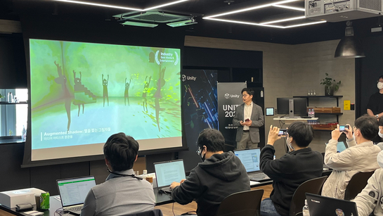

# Unity Korea 旨在通过元宇宙实现现实生活中的利润

周一，Unity Korea 首席布道者 Kim Beom-joo 在首尔南部江南区 Unity Korea 总部展示 Unity 新技术时发表讲话。[团结韩国]

Unity Korea 的首席布道师 Kim Beom-joo 表示，元宇宙不仅仅是虚拟世界中的娱乐和游戏：它还可以帮助公司在现实世界中的工厂和造船厂创造利润。

“我们已与大宇造船和海洋工程 [DSME] 等公司合作，通过应用我们的虚拟技术来创造现实利润，”周一在首尔南部江南区 Unity Korea 总部的金说。“在开发 DSME 的‘智能造船厂’时，集装箱和各种设备的位置通过造船厂的虚拟再现进行实时跟踪，从而将生产力提高了数百倍。”

Unity Korea 是游戏引擎 Unity 开发商 Unity Technologies 的韩国分公司。游戏引擎是用于制作游戏和其他 3 维内容（如电影和动画）的图形软件工具。Unity 与 Epic Games 的虚幻引擎一起是世界上最大的服务之一。

虽然游戏引擎的想法似乎仅限于数字屏幕，但 Kim 认为其实时 3-D 工具包有可能为意想不到的行业增加新的价值。

“我们希望为游戏和虚拟世界以及其他各种行业提供基础技术，”Kim 说。“我们当然会专注于我们的主要兴趣，游戏，但现在的游戏开始通过新的想法和技术影响社会的其他领域。”

对于许多人来说，元界项目在第三季度的表现一直低迷，即使对于推动这一概念的最著名公司 Meta 也是如此。Meta 的第三季度收入下降 4%，而成本和费用同比增长 19% 至 221 亿美元。在元界行业前景不明朗的情况下，Unity Korea 仍然支持元界的希望。

“在研发阶段，例如现在，必须在收入方面做出一些牺牲，”金说。“元界行业正在经历与智能手机行业发展其个人数字助理 [PDA] 所经历的阶段相同的阶段。对许多人来说，这些技术和概念仍然是新的和尴尬的。”

Kim 表示，小开发者在元界行业取得成功的关键是寻求一种价值或共享的社区意识，而不是简单地在元界中开发头像和空间。

“你需要能够为用户提供基本服务，”Kim 说。“这可能是雕刻、创作或创造其他东西——无论是什么，即使是专注于很小的真实体验的元宇宙公司也可以通过扩大这种价值和社区意识来取得成功。”

Unity Korea 周一介绍了其技术的四项新发展：图形、UI 和 UX、性能和游戏服务的更新。引入了用于开发更清晰的动画和渲染的更流畅的图形，同时展示了 Unity 的 UI 和 UX 工具包的扩展编辑器版本。展示了可提高游戏性能的面向数据的技术堆栈（“点”）以及用于游戏开发人员监督开发、更新和分发游戏的整个过程的综合工具包。
