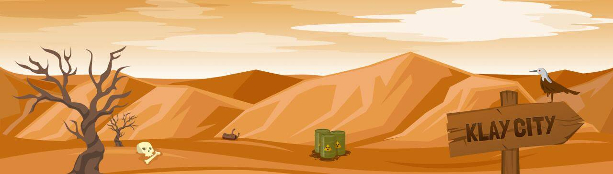

# Klaycity Building MintPass

KlayCity building Mintpasses 是一系列可兑换 KlayCity Building NFT 的通行证。5555 Mintpasses 可以兑换成建筑 NFT，其中包含随机收集的统计数据和奖金，可在 KlayCity 生态系统中使用。

KlayCity 是一个去中心化的虚拟世界，玩家可以在其中探索、清理和升级他们的城市。
选择您的路径，清理 $ORB，生成 $LAY，并发现新的地区 #NFT。

什么是克莱城？
KlayCity 是一个 LANDFI METAVERSE，基于探索、清理和贸易。KlayCity 是第一个建立在 Klaytn 上的官方超宇宙陆地项目。

什么是LAY007？
LAY007 是用于挖掘隐藏在 Districts 下的 $ORB 的设备。Lay007 也可用于探索新区域。

什么是 $ORB？
$ORB 是 Klayland 的效用和治理代币。它用于升级您的地区并为未来的游戏重新平衡投票。

如何铸造一个地区？
最初只出售 1,000 个地区。只有完成发射任务的参与者才能铸造他们的地区。

我什么时候可以铸币我的区，它的成本是多少？
每个地区的铸币成本为 1,000 KLAY，铸币定于 12 月中旬进行。

我可以用我的区做些什么？
地区是可升级的 NFT，具有 3 个稀有等级和 6 个最高等级。地区每月生成 LAY007。

