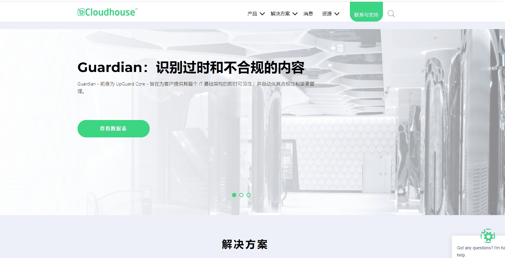

# 0 Cloud House 01

部署在 Server 2003、2008 和 2008 R2 上的 N 层应用程序与 Windows Server 2016 和 2019 不兼容，要么是因为它们依赖于 Java 1.3 或 .Net 2.0 等旧运行时，要么对操作系统有硬编码依赖，要么您缺少安装媒体。

如果您的任务是在新的数据中心、云或混合云中将 Server 2003 或 2008 应用程序迁移到 Server 2016 或 2019，您可能面临以下一些挑战：

• 没有安装媒体或源代码
• 应用程序使用 SQL Server 2005
• 基础结构依赖于服务器和数据库名称

Cloudhouse 应用程序兼容性包使您能够可靠地解决兼容性问题，隔离 Java 和 .Net 等旧运行时，以便您可以安全地将应用程序迁移到受支持且安全的最新 Windows 操作系统，而不会影响高可用性和灾难恢复。

• 使用我们的兼容性、重定向和隔离引擎在 Server 2016 和 2019 上运行不兼容的应用程序和运行时
• 通过网络重定向克服对服务器名称、IP、数据库等的依赖
• 不需要媒体 - 运行时分析意味着我们可以自动提取应用程序从服务器

