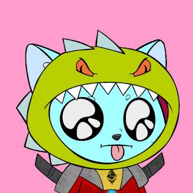

# Clever Cats Collective

项目网站、社交联系方式、项目介绍内容详见：https://opensea.io/collection/clever-cats-collective

##### 什么是聪明的猫集体？

Clever Cats Collective 是一个 NFT（非同质代币）集合。存储在区块链上的数字艺术品集合。

##### ▶ 有多少个 Clever Cats Collective 代币？

总共有 3,077 个 Clever Cats Collective NFT。目前，131 位所有者的钱包中至少有一个 Clever Cats Collective NTF。

##### ▶ 最昂贵的 Clever Cats Collective 促销活动是什么？

售出的最昂贵的 Clever Cats Collective NFT 是 [Clever Cat #355](https://www.nft-stats.com/asset/0xd854db2160576456f0d10d799beceaae5101efa8/355)。它于 2022-06-13（3 个月前）以 2.2 美元的价格售出。

##### ▶ 最近卖出了多少 Clever Cats Collective？

过去 30 天内售出了 2 个 Clever Cats Collective NFT。

