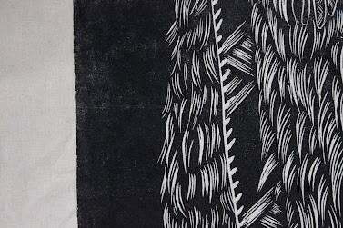
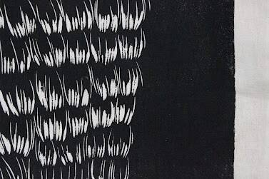
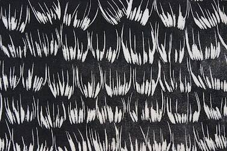

# Cloak 44

项目网站、社交联系方式、项目介绍内容详见：https://opensea.io/collection/cloak-44

Cloak 44 是 Dominique Baker 的一个系列，由 44x 1/1 NFT 组成，由一个大型木版浮雕印刷 IRL 制成。物理印刷品（尺寸为 2.4mx 1.2m）首先使用 Yoshiharu 钢凿雕刻在 mdf 木材上。仅雕刻就需要大约 40 个小时才能完成。然后用黑色水性墨水将完成的雕刻翻过来。然后将由 100% 棉制成的织物铺在墨水上，在贝克的丈夫 Hamish Wight 的帮助下，它被一个 2.5 吨重的道路施工钢辊压倒。

每个 NFT 都是最终浮雕的特写，创造出美丽的高分辨率图像，非常适合打印或作为 Metaverse 中的大型背景。

该系列中的四个 NFT 已作为艺术家副本保存以供印刷发行

