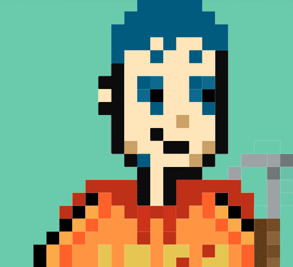

# Closed. (A bug has happened. sorry)

项目网站、社交联系方式、项目介绍内容详见：https://opensea.io/collection/closedsorry

当 Doji Sound Club 的小伙伴们通过 NFT 交易成为超级富豪时，嫉妒的反派 AI Chronium 诱骗小伙伴们喝下有毒的威士忌作为礼物。喝下毒药的伙伴们并没有死去，而是陷入了很长的睡眠，而 Chronium 在接管区块链基础设施的同时，拆除了他们的藏身处道奇声音俱乐部。

小伙伴们在 10 年后醒来并试图恢复，但奇怪的是，他们不记得包含他们大部分财富的加密货币钱包的助记键。为了防止 AI Chronium 通过互联网访问它们，伙伴们躲藏起来，经营着 BMCS，这是一家无需电脑也能赚钱的自行车商店。为了隐藏自己的身份，伴侣不再称对方为伴侣，而是BIAS。（BIAS 的意思是“最好的爱”。）

