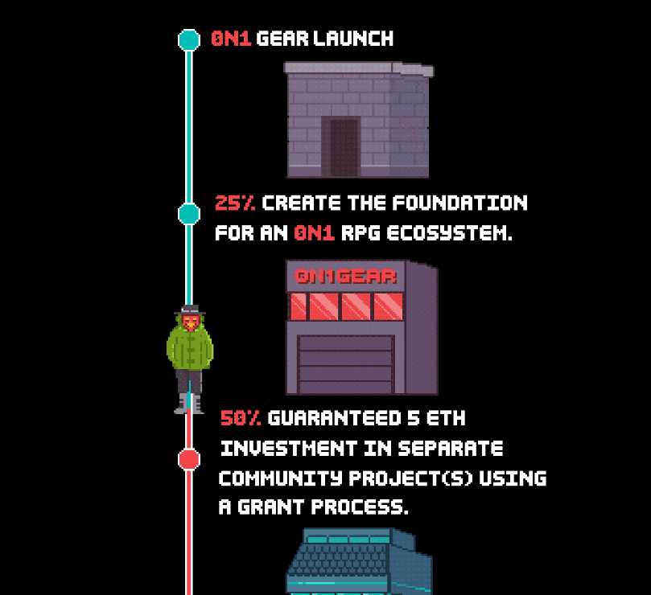

# 0N1 Gear

随着皇帝的去世，事情变得非常糟糕，非常快。每个 0N1 都是为自己而存在的，这些袋子里装满了武器和盔甲，这可能是你度过各种与轮班相关的危险向我们前进的唯一原因。每个 0N1 一个袋子。没有例外。

我将于 10 月 9 日美国东部标准时间上午 11:00 在 The Vents 的后巷闲逛。你最好出现，英克雷警察不欣赏我的生意

如果你是 0N1，0.025 ETH，我会给你一个特别的折扣。人类必须额外支付 0.05 ETH。

这些袋子不仅包含任何物品，它们还拥有您维持生命所需的工具。轮班活动只会越来越强，还不如做好准备。

