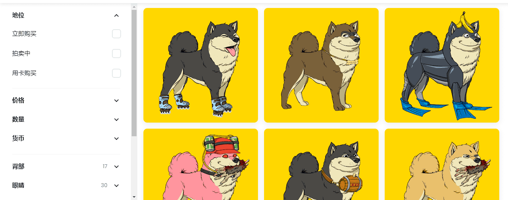

# 0xBAKC

▶ 什么是 0xBAKC？
0xBAKC 是一个 NFT（非同质代币）集合。存储在区块链上的数字艺术品集合。
▶ 0xBAKC 代币有多少？
总共有 6,119 个 0xBAKC NFT。目前，1,431 位所有者的钱包中至少有一个 0xBAKC NTF。
▶ 最昂贵的 0xBAKC 销售是什么？
售出的最昂贵的 0xBAKC NFT 是 0xBAKC #12471。它于 2022 年 6 月 27 日（2 个月前）以 65.9 美元的价格售出。
▶ 最近卖出了多少个0xBAKC？
过去 30 天内售出了 145 个 0xBAKC NFT。
▶ 0xBAKC 的成本是多少？
过去 30 天，0xBAKC NFT 最便宜的销售额低于 2 美元，最高销售额超过 16 美元。过去 30 天 0xBAKC NFT 的中位价格为 8 美元。

