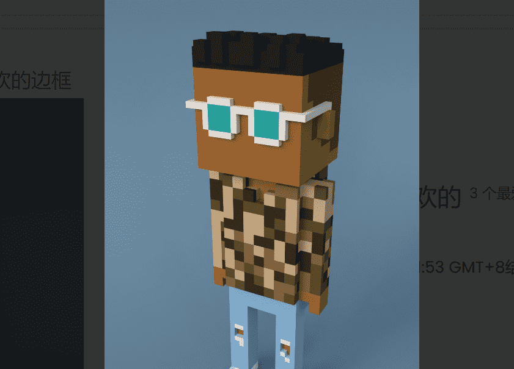

# 0xMeebits

项目网站、社交联系方式、项目介绍内容详见：

0xMeebits 是 1,111 个独特的 3D 体素字符，由自定义生成算法创建，然后在以太坊区块链上注册。Reveal 和元数据即将推出。

0xMeebits 是一个 NFT（不可替代代币）集合。存储在区块链上的数字艺术品集合。

总共有 786 个 0xMeebits NFT。目前 239 位所有者的钱包中至少有一个 0xMeebits NTF。

