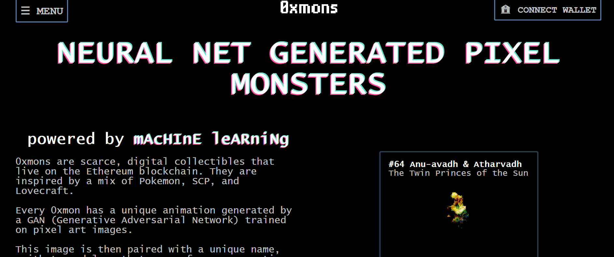

# 0xmons

项目网站、社交联系方式、项目介绍内容详见

0xmons 是存在于以太坊区块链上的稀有数字收藏品。它们的灵感来自 Pokemon、SCP 和 Lovecraft 的混合。

每个 0xmon 都有一个由 GAN（生成对抗网络）生成的独特动画，该 GAN（生成对抗网络）在像素艺术图像上训练。

然后将此图像与来自生成语言模型（想想 GPT-3）的唯一名称、绰号和知识配对。

