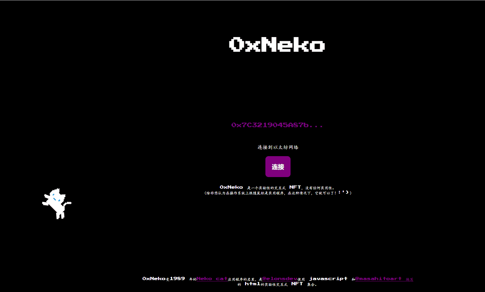

# 0xNeko

0xNeko 是一个实验性的交互式 NFT，没有任何实用性。

（除非你认为在操作系统上跟随你的鼠标是实用的，在这种情况下，它得到了它！:）

灵感来自 1989 年的 Neko cat 应用程序。 0xNeko 是 elonsdev 使用 masahitoart 的 javascript 和 html 开发的实验性交互式 NFT 集合。

*Etherscan 上的0xNeko* (NEKO) 代币跟踪器显示代币的价格为 0.00 美元、总供应量 100、持有者数量 75 以及代币的更新信息。

