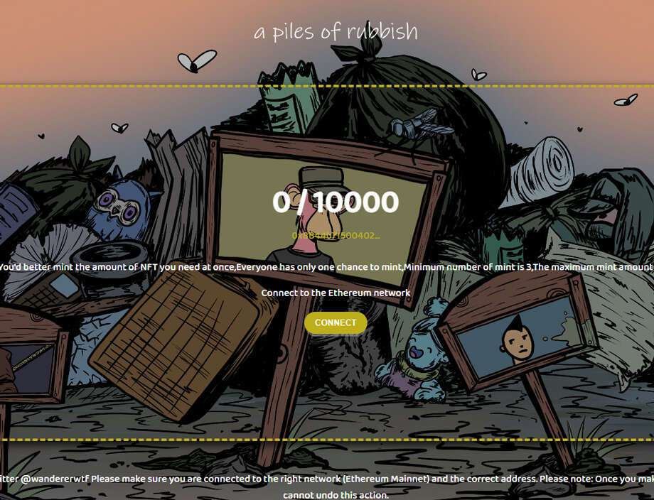

# Apilesofrubbish

Fxxk 将所有这些可怕的事件放入垃圾填埋场，加入真正的垃圾堆。Apilesofrubbish 于 2022 年 6 月 11 日首次铸造。我们目前正在追踪 9,998 个流通中的 Apilesofrubbish 代币，这些代币尚未被烧毁或质押。我们为 Apilesofrubbish 索引了 255 个独特的特征对。最常见的购买 Apilesofrubbish 的地方包括 OpenSea 和 LooksRare 等市场或 Gem.xyz 和 Genie.xyz 等聚合器。链接可以在上面找到！Apilesofrubbish目前的销售楼层为Ξ 0.001。我们的销售楼层基于最近的销售情况，已删除异常值。迄今为止，我们已经为 OpenSea、LooksRare、Gem.xyz 和 Genie 上的 Apilesofrubbish 共11,136 笔销售编制了索引。
