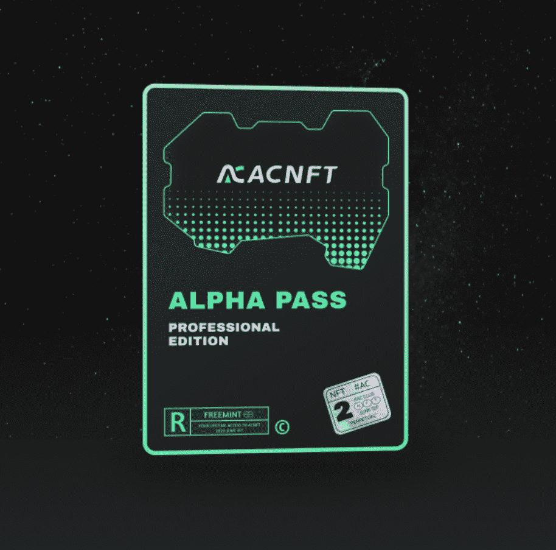

# ACNFT PASS

作为 ACNFT 收藏家通行证持有者，您将可以访问不断发展的收藏家仪表板和功能，让您随时掌握最热

门的薄荷糖

ACNFT PASS NFT 在过去 7 天内售出 29 次。ACNFT PASS 的总销售额为 11.23 万美元。一张 ACNFT 

PASS NFT 的平均价格为 387.4 美元。共有 328 位 ACNFT PASS 持有者，总共拥有 438 个代币。

##### ▶ 什么是 ACNFT PASS？

ACNFT PASS 是一个 NFT（Non-fungible token）集合。存储在区块链上的数字艺术品集合

▶ 最昂贵的 ACNFT PASS 销售是什么？

出售的最昂贵的 ACNFT PASS NFT 是 ACNFT PASS。它于 2022-06-11（3 个月前）以 589.8 美元的价

格售出。

▶ 最近卖出了多少 ACNFT PASS？

过去 30 天内售出了 100 个 ACNFT PASS NFT。

