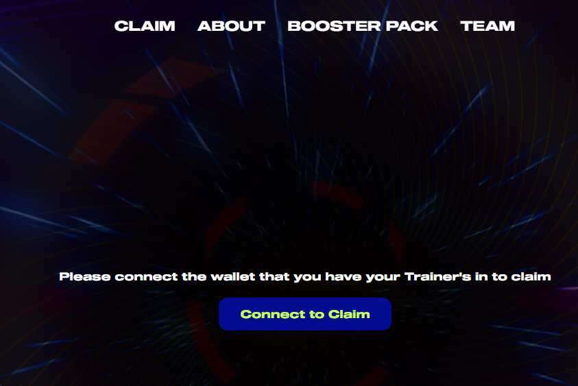

# AD Trainers

感谢所有投资并相信这个项目的人。我们非常高兴与您一起开始这段旅程。

AnekDamian 的培训师（A/D 培训师）是在以太坊区块链上以编程方式生成的 NFT 的艺术优先集合。第一阶段由 999 个随机生成的字符组成。

A/D 运动鞋是由我们的艺术专家团队在多年致力于顶级定制收藏品之后设计的。我们的使命是发展我们对物理宇宙的愿景并将其与元宇宙联系起来。Phygital Art，如果你愿意的话。

带回怀旧之情，打开一个补充包将解锁 4 个 NFT：1 个 A/D 训练师 + 3 个元素卡。

打开助推器包将是无气的，并且将立即在您的 opensea 库存中可用。

在 A/D 世界中有 4 个基本元素：火、水、草和精神。然而，有传言说特殊元素在四处飘荡。

特殊元素极为稀有且备受追捧。

