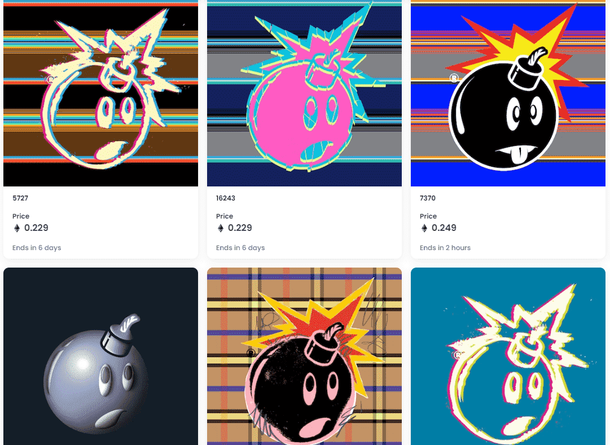

# Adam Bomb Squad

什么是亚当炸弹小队？

Adam Bomb Squad 是一个 NFT（不可替代代币）集合。存储在区块链上的数字艺术品集合。

Adam Bomb Squad 代币有多少？

总共有 24,999 个 Adam Bomb Squad NFT。目前，8,508 位车主的钱包中至少有一个 Adam Bomb Squad NTF。

Adam Bomb Squad 最昂贵的交易是什么？

售出的最昂贵的亚当炸弹小队 NFT 是 . 它于 2022 年 8 月 11 日（21 天前）以 280 美元的价格售出。

最近卖出了多少亚当炸弹小队？

过去 30 天内售出了 387 个 Adam Bomb Squad NFT。

亚当炸弹小队的费用是多少？

在过去 30 天里，Adam Bomb Squad NFT 最便宜的销售额低于 345 美元，最高销售额超过 914 美元。过去 30 天，Adam Bomb Squad NFT 的中位价格为 422 美元。

