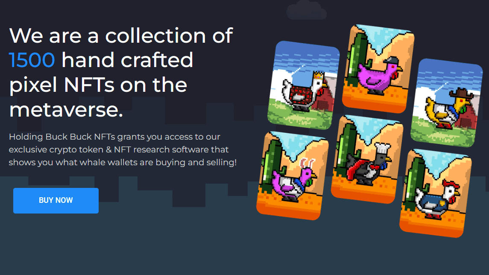

# Buck-Bucks!

持有 Buck Buck NFT 可让您访问我们独家的加密代币和 NFT 研究软件，向您展示鲸鱼钱包的买卖情况！

作为一名 NFT 交易员，他在某些项目中将 NFT 的价值从 5,000 美元变成了超过 150,000 美元以上，我曾以为我想通了。研究 NFT 成为一门艺术，找到合适的 NFT 与合适的社区铸造是让我的 NFT 翻转之旅成功的关键。

我的问题是我自己手动进行所有研究。这很烦人，我花了一天的大部分时间来寻找人们正在购买的合适的 NFT，并且它变成了一份全职工作

我终于意识到我的成功来自于寻找/铸造和购买其他成功的 NFT 交易者在市场上所做的 NFT！我发现和翻转的最好的 NFT 来自那些已经是成功的交易者和那些做出最好动作的人。

所以我跟踪他们，使用 etherscan 和 Zerion 等应用程序来跟踪他们的钱包动向……。

问题仍然存在，打开钱包并查看每个人手动购买的东西仍然是一项全职工作 ONE ... BY ...。一 … 。

这就是 Vanyosoft 诞生的地方，也是事情开始变得有意义的地方！

如果我可以将所有顶级钱包和最好的 NFT 交易者都集中在一个地方，以便我能够同时跟踪所有这些钱包及其动向，那会怎样。

这样……我可以在一个仪表板中看到他们购买和出售的一切！

瞧……这让我每天研究他们的钱包动向节省了超过 12 个小时，让我能够准确地看到他们正在铸造和从 Opensea 购买的新 NFT！

我现在可以每天花 5-10 分钟而不是每天 12 小时打开 Zerion 和 Etherscan 来跟踪他们的钱包动向。

