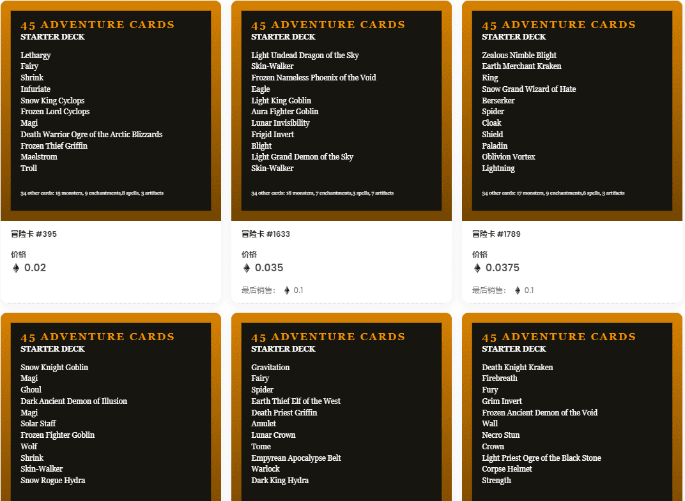

# Adventure Cards

Adventure Cards 是第一个完全存储在链上的可收集纸牌游戏。每个 NFT 包含45 张程序生成的卡片，足以玩一局完整的游戏。

受 LOOT 和 MtG 的启发，冒险卡是加密原语。你可以对他们做任何你想做的事情。他们可以免费铸造（除了......你知道......气体）

有四种类型的牌：生物、神器、结界和咒语。你应该注意到那里有一些熟悉的东西。

什么是冒险卡？

Adventure Cards 是一个 NFT（不可替代代币）集合。存储在区块链上的数字艺术品集合。

有多少冒险卡代币？

总共有 4,901 张冒险卡 NFT。目前，1,710 名所有者的钱包中至少有一张 Adventure Cards NTF。

最昂贵的冒险卡销售是什么？

NFT 出售的最昂贵的 Adventure Cards 是 Adventure Cards #2629。它于 2022-08-30（4 天前）以 14.1 美元的价格售出。

最近卖出了多少张冒险卡？

过去 30 天内共售出 15 张 Adventure Cards NFT。

冒险卡要多少钱？

在过去 30 天内，最便宜的 Adventure Cards NFT 销售额低于 1 美元，最高销售额超过 14 美元。过去 30 天 Adventure Cards NFT 的中位价格为 13 美元。

