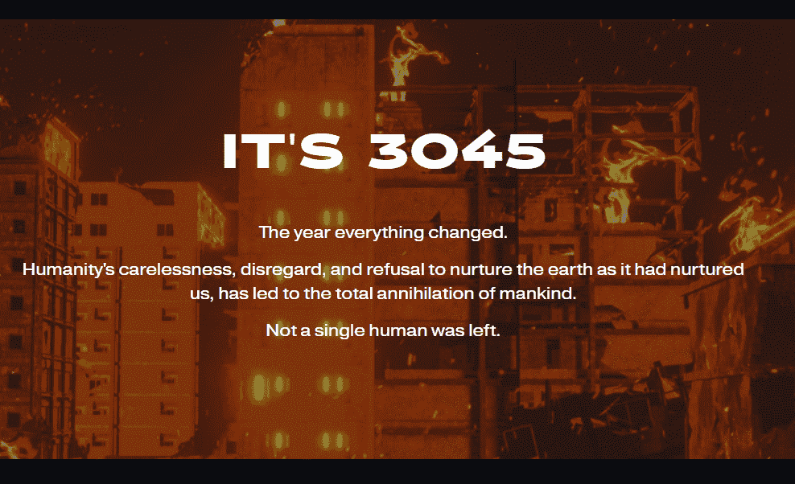

# AfroDroids By Owo

那一年一切都变了。人类的粗心大意、漠视和拒绝像地球养育我们那样养育地球，导致了人类的彻底灭绝。一个人都没有留下。人类互相争斗，互相统治，各派各出各的武器，制造混乱，一个新的生命诞生了。一种具有人类意识的优越力量，可以取代人类并接管世界——AfroDroids。这些具有人类情感的 AfroDroids 生活在矛盾中……他们是人还是机器？这些具有人类情感的 AfroDroids 生活在矛盾中……他们是人还是机器？

12,117 个 AfroDroids 作为 ERC-721 代币存储在以太坊区块链上
每个 NFT 将花费 0.07 ETH + gas
每笔交易最多购买 20 个 AfroDroids
没有层级或结合曲线
IPFS 上托管的元数据和图像（注意：计划在 10 月底迁移到 IPFS）
头 + 躯干图像将在初始掉落时铸造
Rigged 3D 和 AR 模型将在投放后提供
每个铸币的 20% 将捐给慈善机构，直接写在智能合约中

