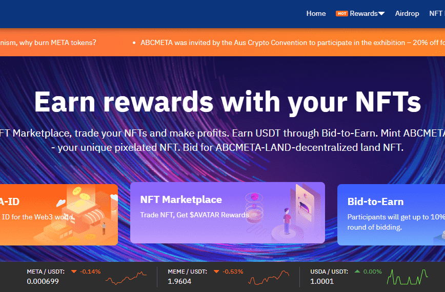

# AGE-META-PASS

ABCMETA是一家面向全球的元宇宙身份NFT铸造与交易平台。致力于通过NFT为用户铸造元宇宙中唯一身份并提供去中心化的自由交易转让。每个NFT身份都是独特的，唯一的，不可复制的，且具有传承，保值，增值的特性。

ABCMETA是一个基于150101块土地构成的超级元宇宙项目. 玩家可以在这里轻松创建属于自己的轻量化可视化元宇宙。

用户可以在这里定制自己的Web3身份ID,创建去中心化共创作品集，建立属于自己的DAO，还可以通过参与土地竞拍，边拍边赚，NFT交易，创建NFT，质押土地，增加USDA流动性等模式实现你的元宇宙收益。

 

ABCMETA旨在链接现实和虚拟，通过提供真正的所有权，数字稀缺性、货币化能力和互操作性的优势，吸引加密货币和非加密货币的元宇宙爱好者。

我们的使命是为用户提供：

简单且低门槛铸造与交易NFT；

建立元宇宙中的Web3身份标识 - ABCMETA-ID；

让ABCMETA-LAND为载体为用户提供持续收益机会；

让每个用户简单链接元宇宙,享受元宇宙的超级红利。

