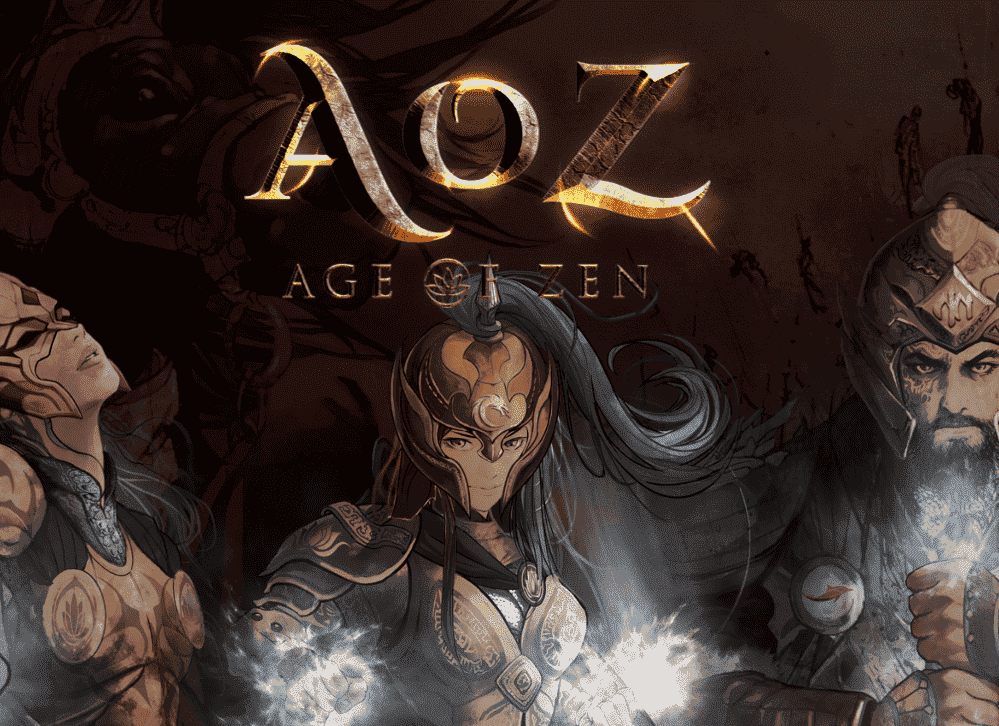

# Age of Zen Heroes

自去中心化世界末日以来，已经过去了 3 亿年。有人建造的“文明地牢”是一切重新开始的地方。太阳失去了光芒，月亮被摧毁了。但是关于人类文明的信息被保存、加密并存储在地牢中。地球变成了一个完全不同的气候和生态系统。

这个故事开始于“mahAdvIpa”，这是 3 个帝国在 2022 年交战的土地。这 3 亿年的大部分时间都充满了黑暗时代。一天，加密信息被泄露。新形成的人类只能处理其中的一小部分信息。人类只是形状相似，但许多不同。这可能是 mahAdvIpa 与 3 亿年前地球相似的原因吗？然而，这个新地方以一种神秘的方式结合了中世纪的东西方。没有太阳也没有月亮的新地球，而是围绕着大气层的云状闪亮环。有一种新的能量从地球上涌现。

