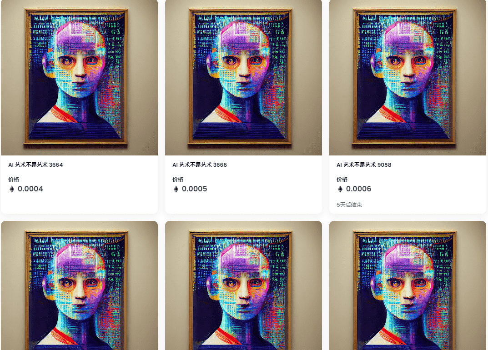

# AI art is not art

什么是三聚氰胺？

AI art is not art 是一个 NFT（不可替代代币）集合。存储在区块链上的数字艺术品集合。

AI art is not art 代币有多少？

总共有 1 个 AI art is not art NFT。目前 10 位业主的钱包中至少有一个 Loy City NTF。

AI art is not art 最昂贵的交易是什么？

AI art is not art 卖的最贵的是 元阳票]。它于 2022-06-18（3 个月前）以 2740 万美元的价格售出。

最近卖出了多少 AI art is not art？

过去 30 天内售出了 95 个 LAI art is not art NFT。

AI art is not art 的费用是多少？

在过去 30 天里，AI art is not art NFT 最便宜的销售额低于 7000 美元，最高销售额超过 1137 万美元。过去 30 天 Loy City NFT 的中位数价格为 988,000 美元。

