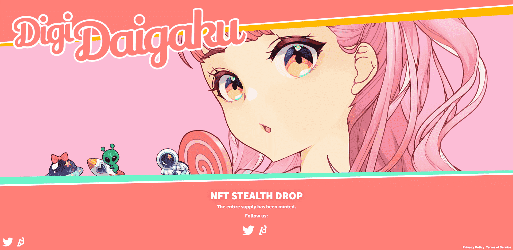

# AI DigiDaigaku Genesis

官方 DigiDaigaku 是由 2022 年开发的独特角色的集合

拥有建立像 Machine Zone 这样的游戏帝国的丰富经验，我们与 LimitBreak 创始人合作得很好
@gabrielleydon
引领我们进入 web3 游戏的下一个时代

YGG 购买了 DigiDaigaku 中的 NFT 资产，这是 Limit Break 的第一个 NFT 系列，为加密游戏带来动漫风格的角色和新的“免费拥有”模式。Limit Break由前Machine Zone首席执行官 Gabriel Leydon创立，是一家 Web3 游戏公司，致力于打造具有数字所有权的大型多人在线 (MMO) 游戏。

YGG 在公开市场购买时已获得 22 个 DigiDaigaku NFT，价值 51,303 美元。通过这个，公会将能够生产更多的 NFT 来装备 YGG 社区，因此他们可以在 DigiDaigaku 生态系统启动后参与各种游戏体验。

Gabriel Leydon 是一位拥有 20 多年经验的游戏开发资深人士，他是 Machine Zone 的联合创始人兼前首席执行官，该工作室是一家游戏开发工作室，于 2020 年被 AppLovin 以 3 亿美元收购。Gabriel Leydon 之前在 Machine Zone 担任过职务监督了一些有史以来最大的手机游戏的开发和营销，包括 Game of War、Goldstrike 和 Final Fantasy。

YGG 的联合创始人 Gabby Dizon 表示：“在提供具有大众吸引力的游戏方面，我们 YGG 完全相信 Gabriel 的能力和专业知识。” “我们对创新的 Web3 游戏模式持开放态度，并期待 Limit Break 团队能够提供的各种游戏体验。”

