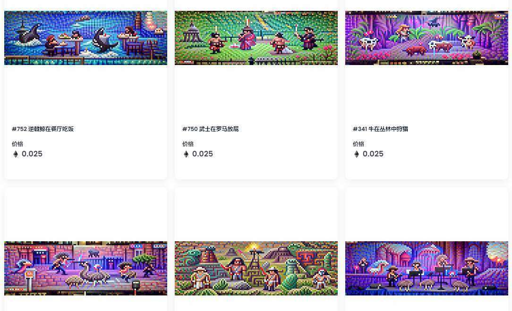

# AI Pixel Buddies

迄今为止第一个 NFT 横幅项目和最准确的生成 AI 艺术项目！

我们周围的空气充满了数据。二进制信号在无休止的流中脉动。从萨拉托加到加拉加斯。从东京到莫斯科。如果你仔细放大这些信号，你会惊讶于你能找到什么。1 和 0 之间隐藏着一些东西。

我们为您带来 AI Pixel Buddies。1000 个立体模型的集合，以纪念与技术进步相关的创造力。每件作品都是从头开始生成的人工智能（没有重复使用的资产），整个系列试图以幽默的方式捕捉存在于我们周围的人工智能的无形世界。有时，信号以不明显的方式解释，导致有趣的伪影。

psst，尺寸似乎适合标题照片。

什么是 AI Pixel Buddies？

AI Pixel Buddies 是一个 NFT（Non-fungible token）集合。存储在区块链上的数字艺术品集合。

存在多少 AI Pixel Buddies 代币？

总共有 1,000 个 AI Pixel Buddies NFT。目前，389 位所有者的钱包中至少有一个 AI Pixel Buddies NTF。

最近卖出了多少 AI Pixel Buddies？

在过去 30 天内售出了 0 个 AI Pixel Buddies NFT。

