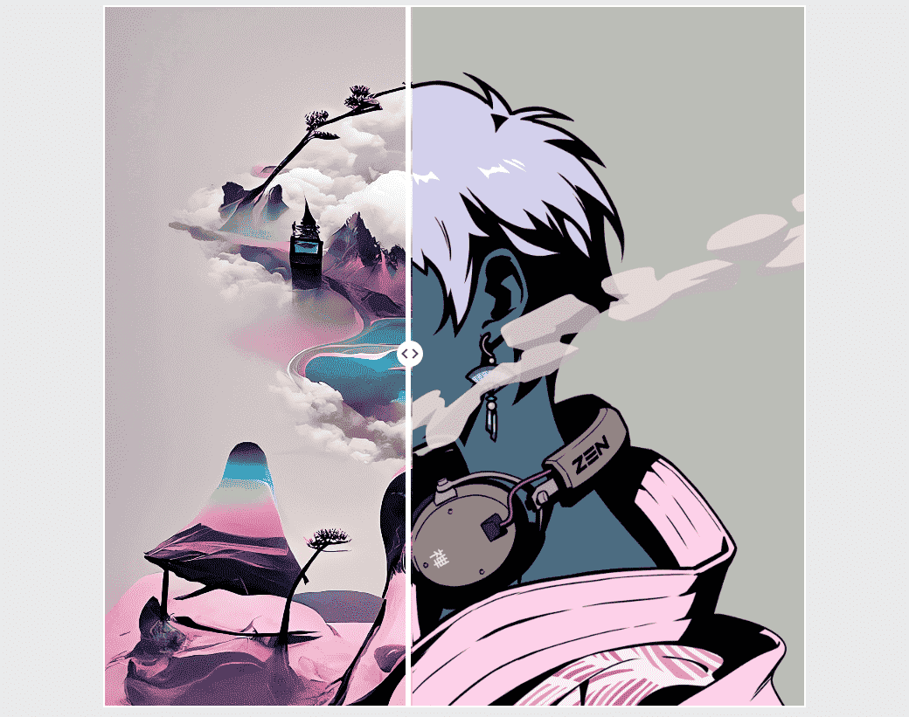

# AI-Zuki

AI-Zuki 是一个使用随机 Azukis 作为基础图像的 AI 生成艺术实验。

不隶属于 AZUKI 或 CHIRU LABS。

出生于澳大利亚墨尔本。我们为 Web3 制作 AI 生成的艺术。AI-Zuki
的制造商，一个小型 NFT 集合的 AI 混音 Azukis。不以任何方式隶属于 Azuki 或 Chiru Labs；只是巨大的粉丝。

我们为 AI-Zuki 运行了 24 个 NVIDIA RTX A6000 GPU，能够同时扩展和高效运行 100 多个 GPU。

AI Diffusion (over GAN) 是我们的专长；我们可以在有非常独特要求的情况下自定义创建模型 (CLIP)。

全栈 Web3 开发，包括智能合约

