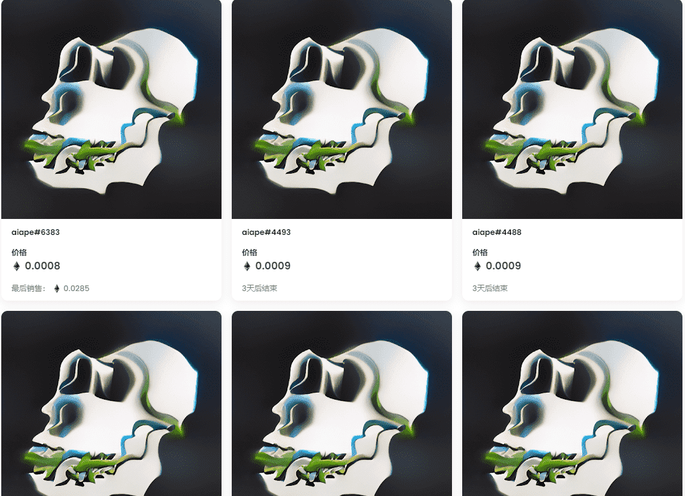

# Ai Apes Collection

什么是 Ai Apes 系列？

Ai Apes Collection 是一个 NFT (Non-fungible token) 集合。存储在区块链上的数字艺术品集合。

Ai Apes Collection 代币有多少？

总共有 10,000 个 Ai Apes Collection NFT。目前，3,356 位车主的钱包中至少有一个 Ai Apes Collection NTF。

最贵的 Ai Apes Collection 拍卖会是什么？

出售的最昂贵的 Ai Apes Collection NFT 是 aiape#8972。它于 2022-06-05（3 个月前）以 42.7 美元的价格售出。

最近卖出了多少个Ai Apes Collection？

过去 30 天内共售出 74 个 Ai Apes Collection NFT。

Ai Apes Collection 需要多少钱？

过去 30 天，最便宜的 Ai Apes Collection NFT 销售额低于 0 美元，最高销售额超过 2 美元。过去 30 天 Ai Apes Collection NFT 的中位价格为 1 美元。

