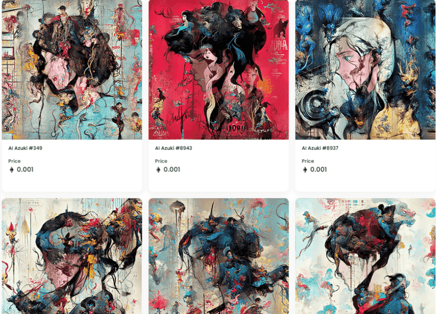

# AIAzukiNFT

10,000 个独特的收藏角色。持有人将获得我们下一个项目的独家访问权。

我们现在正在扫荡财政部钱包，在我们达到逃逸速度之前跳进去点赞和转发以进入我们最新项目的 WL 赠品：AI Reien NFT

加入我们的参加薄荷派对。AI Reien NFT 拥有令人惊叹的 5,000 个 AI 生成艺术收藏品，可独家访问我们的 AI 艺术平台。

什么是 AIAzukiNFT？

AIAzukiNFT 是一个 NFT（Non-fungible token）集合。存储在区块链上的数字艺术品集合。

AIAzukiNFT 代币有多少？

总共有 10,000 个 AIAzukiNFT NFT。目前，1,476 位所有者的钱包中至少有一个 AIAzukiNFT NTF。

最昂贵的 AIAzukiNFT 销售是什么？

最昂贵的 AIAzukiNFT NFT 是 AI Azuki #9393。它于 2022 年 6 月 12 日（3 个月前）以 538.9 美元的价格售出。

最近卖出了多少 AIAzukiNFT？

过去 30 天内共售出 1,777 个 AIAzukiNFT NFT。

AIAzukiNFT 需要多少钱？

过去 30 天，最便宜的 AIAzukiNFT NFT 销售额低于 2 美元，最高销售额超过 8 美元。在过去 30 天内，AIAzukiNFT NFT 的中位价格为 3 美元。

