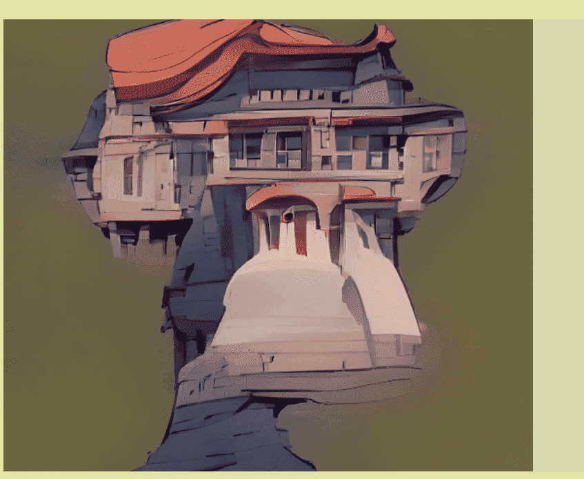

# AIBoredApe

10,000只 AIBoredApes由神经网络数据科学家和人工智能 (AI) 人才团队以及 degen web3 艺术家组成。

让我们引领技术革命，领先于激动人心的人工智能艺术进化！

AIBoredApes NFT 是由 AI 技术生成的高保真图像，主要是 SR3 和 CDM，可用于任何类型的印刷艺术。

AIBoredApes NFT 将驻留在以太坊区块链上。

AIBoredApes NFT 集合中有 10,000 个独特的 NFT。

前 2500 您可以免费获得。剩余的 7500 个，每个价格为 0.001 ETH。

在免费铸币期间（前 2500 个 NFT），每笔交易最多可以铸币 3 个 AIBoredApes。对于剩余的 7500 个 NFT - 每 1 笔交易最多 10 个 AIBoredApes。

您完全拥有 NFT、艺术、技术。NFT 的所有权完全由智能合约和以太坊网络调解：我们在任何时候都不得扣押、冻结或以其他方式修改任何 AIBoredApe 的所有权。

